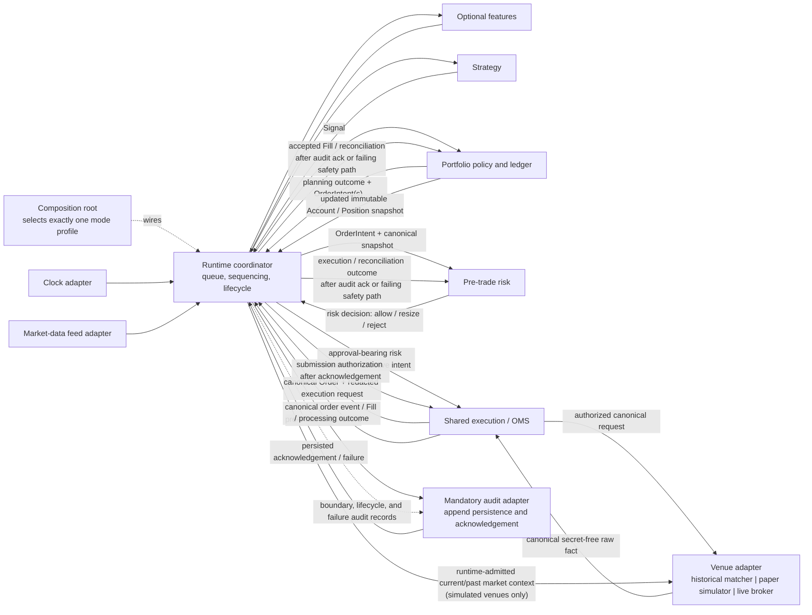

# EA Quant Trading System Architecture

## 1. 设计目标

EA 的目标是成为一个长期运行、持续迭代的量化交易系统，而不是一次性脚本。系统必须先具备工程可靠性，再逐步追求策略收益。

核心目标：

- 可复现：每次回测、纸交易、实盘决策都能追踪到代码 commit、配置、数据版本和参数。
- 可审计：信号、组合目标、风控决策、订单、成交、持仓变更都有日志与 run id。
- 可扩展：数据、策略、风控、broker、存储、监控都通过接口替换。
- 可风控：所有订单必须经过独立风控层；默认 paper/dry-run，实盘需要显式开启。
- 可迁移：先使用 Python-first 单仓库实现薄内核，未来可接入 NautilusTrader、LEAN、vn.py 或专用执行引擎。

## 2. 参考框架与借鉴边界

| 框架 | 借鉴内容 | 不直接照搬的原因 |
|---|---|---|
| QuantConnect LEAN | Universe / Alpha / Portfolio / Risk / Execution 分层，Reality Modeling | .NET/C# 栈较重，二开成本高 |
| NautilusTrader | 研究、仿真、实盘共享事件语义，生产级订单模型 | Rust/Python 混合复杂，API 仍活跃演进 |
| vn.py | Gateway、事件引擎、风控模块、国内市场接口生态 | 偏交易终端/接口平台，研究流水线需补强 |
| Freqtrade | dry-run/live、配置、Docker、WebUI/Telegram、bot 运维 | crypto bot 假设较强，不泛化为全资产核心 |
| vectorbt | 研究阶段高速参数扫描、robustness 检查 | 不适合作为实盘执行核心 |
| Backtrader / Zipline Reloaded | 策略 API、数据 feed、回测 CLI、bundle 思路 | 新项目不宜依赖其作为生产核心 |

这些框架只提供设计输入。本项目以实际数据、确定性测试、风险控制和运行结果作为最终选择标准。

## 3. 统一运行契约

已接受的决策见 [ADR 0003](adr/0003-shared-runtime-ports-and-adapters.md)。所有会产生订单、成交、持仓、P&L 或交易结果的工作流都必须复用同一条逻辑链：

`market event -> strategy -> portfolio -> risk -> shared execution/OMS -> venue adapter`

回测不是第二套交易引擎，而是由历史数据、虚拟时钟和模拟 venue 组成的 adapter profile。研究代码可以只读探索数据；一旦声明交易结果，就必须进入完整 backtest profile。

下面的实线表示消息/数据交接，由 runtime coordinator 统一调度，不表示 Python import。虚线表示 wiring 或审计记录路由。

必须保持以下不变量：

- Runtime 负责图、队列、顺序、生命周期、audit record 路由、outbound pre-effect gate 和
  normal-path inbound-owner acknowledgement gate；不拥有策略、
  组合、风险、撮合、账务政策或 audit persistence。
- Portfolio 先表达目标仓位，再根据 canonical state 产生 `OrderIntent`；目标本身不是订单。每个
  `PortfolioTarget` 都有可审计的 planning outcome（包括 no-op），可产生零个或多个 intent。
- 每个成功完成 risk evaluation 的 intent 都必须得到可审计的 allow/resize/reject decision；
  evaluation failure 使 run failed 且不产生 approved output。reject 到此结束，allow/resize 必须携带
  approval proof 并引用 effective intent 才能进入 execution；execution 不接受 bare `OrderIntent`。
- Runtime 把每个 `OrderIntent` 连同 Portfolio 最新的 immutable canonical `Account` / `Position`
  snapshot 交给 risk；risk 只能派生 exposure，不能维护 shadow ledger。
- Execution/OMS 是唯一的 Order 创建者和订单状态机权威。
- Execution/OMS 先形成 canonical `Order` 与不含密钥的 canonical execution request；Runtime
  只有在 mandatory audit adapter 返回 persisted acknowledgement 后，才授权 execution 提交 venue。
- Venue 只产生 raw execution facts；Execution/OMS 校验、normalize、去重后发布明确 processing
  outcome，accepted outcome 才可包含 canonical order event / `Fill`。
- 每个 inbound raw fact 都由 Execution/OMS 保留真实 source provenance 与 known identifiers，并产出
  immutable processing outcome（包括 accepted、duplicate、invalid/rejected 或 unresolved 结果）；
  正常路径中 Runtime 等到 mandatory audit persisted acknowledgement 后才 dispatch 给 owner，OMS 不直接写 sink。
- Portfolio 只根据 accepted fill 或显式 reconciliation event 修改现金和持仓，并把更新后的
  immutable snapshot 返回 Runtime；outcome 也可交给 risk 更新 derived state，但不能形成第二本账。
- Domain owner 只发布 immutable semantic outcome；Runtime 负责包装并路由 boundary、lifecycle、
  failure audit record 以及 pre-effect gate，stage 不得直接写 audit adapter。
- Historical matcher 和 paper simulator 只消费 Runtime 已准入的当前或过去 market context；它们
  不得拉取或推进 feed、读取 market-data store、查看未来 iterator，或推进 clock。
- 所有 inner components 只能看到 injected clock 已经可见的数据，不可读取未来 iterator、wall clock 或 ambient randomness。

## 4. 领域对象与所有权

第一阶段需要稳定的最小领域对象。这里定义 semantic/state authority 和 handoff；字段、精度和时间 schema 由后续 Issues 决定。

跨 stage 传递的 immutable canonical value/message Python definitions 物理上属于 `core`，
从而避免 policy package 互相 import。下表中的 owner 是语义演进、生产或 mutable state
权威，不表示 value definition 必须放在该 stage。Callable ports 仍由 consumer/use case
拥有，不集中到 `core`。

| 对象 / 能力 | 语义或状态权威 | 生产 / 来源 | 下游交接 | 强制规则 |
|---|---|---|---|---|
| `Instrument` | `core` 共享 identity 语义 | data adapter 解析为 canonical identity | data/features/strategy | `(venue, symbol)` 与 namespace 规则由 [ADR 0004](adr/0004-canonical-market-data-time-and-visibility.md) 定义；vendor identity 不得穿透 adapter |
| `Bar` / `Tick` / market event | data domain 的 canonical semantics | feed adapter 按 clock/as-of 顺序产生 | runtime 投递给 features/strategy | `Bar`、envelope、revision、UTC、visibility 与 market admission ordering 由 [ADR 0004](adr/0004-canonical-market-data-time-and-visibility.md) 定义；feed 不得暴露未来事件；其他 event kind 仍待后续契约 |
| `Signal` | strategy | strategy 只根据已投递数据与自身状态产生 | runtime 交给 portfolio | immutable；不能包含 SDK 调用、Order 或 Fill |
| `PortfolioTarget` / planning outcome | portfolio policy | portfolio 根据 signal、ledger snapshot 和约束产生 | portfolio planner / runtime | target 表示 desired state；每个 target 记录 planning outcome，可产生零个或多个 intent |
| `OrderIntent` | portfolio planning | target 与 canonical current state 的差额 | runtime 连同 canonical snapshot 仅交给 risk | 不能绕过 risk；每个 emitted intent 都需显式 risk outcome |
| risk decision | risk | risk 对成功评估的 intent 给出 allow/resize/reject | runtime；批准结果才交 execution | 必须关联原 intent；reject 是正常结果；不预设 Python schema |
| `Order` / canonical execution request | shared execution/OMS | execution 依据 approved decision 唯一创建 | runtime pre-effect gate，ack 后由 execution 提交 venue | request 必须可审计且已 redacted；vendor wire/auth material 不得离开 adapter |
| raw execution report | venue mechanics | matcher、paper simulator 或 broker adapter 产生 canonical、secret-free raw fact | execution/OMS | 不是 canonical Fill；必须保留真实 source provenance/known identifiers，不能直接改 portfolio |
| `Fill` / canonical order event / processing outcome | execution contract | OMS 校验、normalize、deduplicate raw fact；每个 fact 产生明确 outcome | runtime -> audit acknowledgement（或 failing safety path）-> portfolio/risk/reconciliation | strategy、portfolio、venue 都不能伪造 canonical Fill；duplicate/invalid/unresolved 也不得静默丢弃 |
| `Position` / `Account` | portfolio ledger | accepted Fill 或显式 reconciliation event | updated immutable snapshot -> runtime -> strategy/portfolio/risk/report | broker snapshot 只是 reconciliation observation；risk 不得维护第二本账 |
| audit record / acknowledgement | runtime audit contract；adapter owns persistence | domain semantic outcome 由 runtime 包装，或 runtime 产生 lifecycle/failure record | append-only audit adapter 返回 persisted acknowledgement/failure | 不在此定义 #14 schema；adapter 不改变交易政策，但 acknowledgement 是 side-effect gate |

所有跨边界消息采用 immutable value/message/snapshot 语义。禁止多个模块维护可写的 shadow position、account 或 order state。Stage 只把 semantic outcome 返回 Runtime，不直接写 audit sink。

Strategy-originated flow 必须保留 Signal -> PortfolioTarget -> OrderIntent -> risk decision ->
Order -> Fill 的端到端 correlation，使 audit 与 reconciliation 可以重建完整决策链。
External execution/reconciliation facts 只记录真实 origin 以及已知的 venue/order identifiers；不得
伪造缺失 lineage，也不得因 correlation 尚未解析而丢弃真实 fill。未解析 correlation 的处理由 #15 决定。

## 5. 模块边界

| 模块 | 职责 | 不负责 |
|---|---|---|
| `core` | 领域值、identity、event envelope、跨 stage immutable message definition、时间抽象、错误 | orchestration、I/O、配置、vendor 类型 |
| `runtime` | mode-neutral coordinator、queue、sequencing、lifecycle、audit routing、outbound pre-effect/inbound-owner acknowledgement gates；逻辑 composition boundary | 策略、组合、风险、撮合、账务或 audit persistence policy |
| `config` | outer-boundary typed immutable snapshot、source precedence、校验、secret reference boundary | inner components 的 ambient config 读取、raw credential resolution |
| `data` | 数据接入、清洗、质量检查、存储与 feed adapters | 策略调用或交易决策 |
| `features` | 只基于 as-of 数据的因子、指标、特征工程 | 订单、风险、venue 或未来数据读取 |
| `strategy` | strategy contract、strategy-local state、Signal | PortfolioTarget、OrderIntent、Order、Fill、SDK |
| `portfolio` | PortfolioTarget、OrderIntent、资金分配、canonical ledger、绩效归因 | 风控批准、订单状态机、venue submission |
| `risk` | pre/in/post-trade risk policy、limits/halt/decision/derived state；从 immutable portfolio snapshot 派生 exposure | 订单创建、venue submission、portfolio ledger 或 shadow position/account |
| `execution` | shared OMS、Order 状态机、canonical execution request、venue port、report normalization/deduplication、对账协议 | broker-specific auth/I/O、portfolio mutation 或绕过 runtime audit gate |
| `backtest` | historical feed、virtual clock、只消费 runtime-admitted context 的 deterministic matcher、result adapters profile | 另一套 strategy/portfolio/risk/OMS/ledger/P&L pipeline，或 matcher 主动读取/推进 feed/clock/store |
| `paper` | real/replay feed、real/feed clock、只消费 runtime-admitted context 的 simulated venue profile | external broker order writes、另一套交易政策，或 simulator 主动读取/推进 feed/clock/store |
| `brokers` | live market/venue SDK adapter、protocol translation | inner contracts、risk/portfolio/order policy |
| `monitoring` | mandatory audit append persistence 与 persisted acknowledgement、optional metrics/alerts adapters | 形成 domain outcome、驱动或修改交易政策 |
| `experiments` | run metadata、参数、数据版本、模型版本和结果索引 | runtime trading policy |
| `cli` | 用户输入、输出、退出码，调用 composition facade | 直接调用 strategy/risk/execution 或构造 adapter |

## 6. 依赖方向

消息流与 import 依赖是两个不同视图。消息向外到 venue 再返回；代码依赖始终向内，只有 composition root 负责 wiring。

| 层级 | 可以依赖 | 禁止依赖 |
|---|---|---|
| `core` | Python 标准库和经 ADR 允许的 shared primitives | 其他 `ea` package、mode、SDK、storage |
| policy/contracts：`features`、`strategy`、`portfolio`、`risk`、`execution` | `core` 与本模块 narrow contracts | `cli`、`config`、mode packages、concrete adapters、vendor SDK；stage 之间直接调用 |
| runtime kernel | `core` 与各 stage public contracts | `config`、`cli`、SDK、storage、concrete adapters |
| adapters：`data`、`backtest`、`paper`、`brokers`、`monitoring` | consuming inner port 与 adapter 私有库 | peer adapters、inner mutable state、定义 core-facing contract |
| outer support：`config`、`experiments` | 自身 outer-facing contract、`core` shared values 与各自私有库 | 被 runtime kernel/policy import、ambient configuration 或交易政策 |
| outer composition root | validated config、inner components、concrete adapters | business policy、matching、ledger、mode-specific shortcuts |
| `cli` | composition facade 和 presentation helpers | stage、venue、SDK 或 adapter construction |

Port 属于消费它的 inner use case，不集中堆入通用 `ports` package；这与 dependency-neutral
message definitions 位于 `core` 是两个不同规则：

- runtime owns clock/event-source coordination、mandatory audit、outbound pre-effect/inbound-owner acknowledgement gates 和 result-output ports；
- execution owns venue gateway port；
- strategy、portfolio、risk、execution 各自拥有 stage contract；
- adapter 在边界把 vendor/adapter-specific representation 和 SDK model 翻译为 canonical messages。

唯一 production exception 是 outer composition root：它同时 import inner contracts 与 concrete adapters。逻辑上它位于 `runtime` composition boundary，但实现必须能通过 import-boundary test 与 inner runtime kernel 分离。测试可以显式组装 fakes。

明确禁止：

- strategy -> broker/exchange SDK、venue、OMS、risk implementation、Order 或 Fill；
- portfolio/risk -> venue，或 execution 接受未携带 approved risk outcome 的 bare intent；
- backtest/paper/live 自建 strategy、portfolio、risk、OMS、ledger、fill 或 P&L 语义；
- feed -> strategy direct call，venue -> portfolio/risk direct mutation；
- stage 直接写 audit sink，或 runtime 未收到 persisted acknowledgement 就授权任何 simulated/real venue submission；
- Execution/OMS 静默丢弃 inbound raw fact、擦除真实 provenance，或不返回明确 processing outcome；
- Runtime 在正常路径未收到 inbound outcome 的 audit acknowledgement 就 dispatch 给 state owner；
  audit failure 后只能进入明确的 `failing` safety path；
- matcher/simulator 主动拉取或推进 feed、读取 market-data store、查看 future iterator 或推进 clock；
- inner modules import mode/config/SDK/adapter，adapter import peer adapter，vendor/adapter-private object 穿透 port；
- credentials、signature、token 或 vendor wire object 进入 runtime、domain message 或 audit record；
- adapter 在 audit acknowledgement 后静默改变已审计的 economic order semantics；必要调整必须返回
  Execution/OMS，按影响重新经过 risk，并取得新的 acknowledgement；
- inner components 读取 mode name、environment、filesystem、network、wall clock 或 unseeded randomness；
- CLI 直调 stage、service locator/global singleton、composition root 之外创建 production adapter；
- paper profile wiring 到真实 order-writing venue。

## 7. Composition root

Composition root 是生产图的唯一装配点：

1. 接收已经校验的 configuration snapshot，并且只选择一个 mode profile。
2. 创建 clock、market-data source、features、strategy、portfolio、risk、shared execution/OMS、venue、audit、telemetry 和 result adapters。
3. 验证每个 required port 恰有一个实现，禁止 paper/backtest 使用 real order-writing venue。
4. wiring 完整 graph 后把单一 runtime facade 交给 CLI。
5. 拥有所有 component lifetime；component 不能自行查找或创建 peer。

这一定义不决定配置字段或 live enablement 规则。Live profile 仅保留 substitution boundary，当前不可构建、不可连接。

Issue #13 与 [Accepted ADR 0005](adr/0005-strict-typed-configuration.md) 将配置收敛为 outer
boundary contract：

- v1 `Settings` 包含 `schema_version`、typed `environment` 与唯一 `run.mode`，并传递性冻结；
- defaults、单一 versioned YAML、process environment、CLI 按确定顺序覆盖；
- `EA_CONFIG_PATH` 只选择 YAML，不进入 normalized snapshot；
- YAML 是 single-document closed schema，重复/未知 key 失败；未知/旧版/歧义 `EA_*` 名称也失败；
- raw credential 不进入 config、CLI diagnostic、runtime message 或 audit；
- `SecretRef` 只表示 opaque identifier，不解析 payload；
- `live` vocabulary 被保留，但所有来源合并后由最终 snapshot fail closed，现有配置不能构建 live graph。

只有 composition root 接收完整 snapshot。Inner runtime 与 policy 只能接收装配后的 narrow value /
capability，不得回读 snapshot、environment、filesystem 或 CLI。

Issue #14 与 [Proposed ADR 0006](adr/0006-reproducible-run-manifest-and-audit-lineage.md)
定义 run preparation 与 lineage boundary：

- UUID4 `run_id` 标识单次执行尝试，deterministic `lineage_sha256` 标识等价的可复现输入；
- v1 preparation 只接受 bounded `backtest`，paper/live 需要未来 manifest schema；
- lineage 覆盖 clean commit、normalized configuration、完整 point-in-time data fingerprint、
  UTC replay window、effective parameters、runtime/dependencies 和 explicit seed；
- exact `MarketDataEnvelope` tuple 按 ADR 0004 校验/排序，以 `available_at` 的半开区间选择并
  fingerprint，同一 tuple 才能交给 historical feed；
- outer experiments boundary 原子占有 `results/<run_id>/`，durably 写入 immutable manifest
  后才公开 prepared context；现有/poisoned 路径永不复用、清理或覆盖；
- store registry 将每个 pathless child capability 绑定到 exact store、attempt 与 role；
  composition 只把不重叠的 `audit/` 和 `outputs/` capability 分别交给 monitoring/result
  adapter，跨 store/attempt/role 替换在构造 binding 时失败，adapter 与 policy 都不能取得或
  遍历 run root；
- composition 使用同一个 narrow `RunReference(run_id, lineage_sha256)`、manifest-file digest
  与各自 child capability 预绑定 concrete audit/result adapter；inner runtime 只接收
  `RunReference` 与已绑定 ports。任何一方都不接收 manifest serializer、configuration、
  data adapter 或 result-root path。
- production path 必须从 tracked stdlib-only launcher 开始；它在任何 `ea` import 前完成检查，
  只在成功后的 bootstrap stack frame 内创建一次性 grant，且 module 不暴露 constructor、
  issuer seal 或 publisher；登记 exact process-local pending identity 后才动态导入
  `ea.composition.run`。Composition 仅兑换同一 object identity、立即清除 pending grant并
  签发一次性 preflight session；structural fake 或 direct-loaded launcher module 都不能自行
  mint grant。Preparation 强制消费该 session，从中取得 repository/commit，重新建立 evidence；
  `LocalResultStore`
  durable 返回后才构造 adapter，并在首条 mandatory audit acknowledgement 后才交出 exact
  event tuple、lineage-bound RNG 与 ordered-float64 capability。直接导入 composition 或单独
  调用 manifest/store helper 不构成可复现完成或运行声明。

Prepared manifest 不等于 completed reproducibility claim；terminal audit/output evidence 保持为
独立 write-once record，避免改写 manifest 或形成 audit hash cycle。Editable-checkout run 在
terminal claim 前必须通过 store-owned manifest capability 以 no-follow 方式重读原文件并核对
file identity、canonical bytes、digest 与 `RunReference`，同时重新验证相同 clean HEAD、
lock/runtime evidence 与 prepared data tuple。

## 8. Mode adapter matrix

| 关注点 | Backtest | Paper | Live（未来 contract） |
|---|---|---|---|
| driver / clock | deterministic virtual clock 和 event driver | injected real/feed clock 和 scheduler | injected real clock 和 scheduler |
| market-data feed | bounded ordered historical/as-of feed | live 或明确 replay feed | live market-data adapter |
| features / strategy / portfolio / risk | mode-agnostic contracts/policies | 同一套 mode-agnostic contracts/policies | 同一套 mode-agnostic contracts/policies |
| execution / OMS | mode-agnostic shared implementation | 同一 shared implementation | 同一 shared implementation |
| venue | deterministic historical matcher/model adapter | paper simulator | external broker venue adapter |
| simulated venue market context | 只消费 runtime-admitted current/past context | 只消费 runtime-admitted current/past context | 不适用；broker 自行产生 external facts |
| order writes | audit persisted acknowledgement 后才写 simulated venue | audit persisted acknowledgement 后才写 simulated venue | 独立 live authorization 且 audit persisted acknowledgement 后才允许 external write |
| Fill / Account / Position | matcher facts -> shared OMS -> shared ledger -> updated immutable snapshot | simulator facts -> shared OMS -> shared ledger -> updated immutable snapshot | broker reports/snapshots -> shared OMS/reconciler -> shared ledger -> updated immutable snapshot |
| audit / result | mandatory run-scoped audit 和 deterministic result；terminal failure fails run | mandatory durable audit/result；terminal failure fails run | mandatory durable audit/result；terminal failure fails run |
| optional telemetry | best effort，不影响 decision | best effort，不影响 decision | best effort，不影响 decision |
| 当前状态 | contract only，Phase 1 待实现 | contract only，Phase 3 待实现 | unavailable；不得由现有 flag 构建 |

任何 mode 都不能移除 risk/execution/audit gate 或以 mode branch 替换 inner policy。配置值可以不同，inner code 不读取 mode。Historical matcher 和 paper simulator 不得主动访问 feed、market-data store、future iterator 或 clock；Runtime 提供的 as-of context schema 与 ordering 由 #12/#15 决定。

## 9. 生命周期与失败边界

每个 graph 单次使用：

`constructed -> starting -> running -> stopping -> stopped`

fatal path 为 `starting | running | stopping -> failing -> failed`。`stopped` 与 `failed` 都是
terminal；`failed` 只能在 safety drain 和 cleanup 完成后进入。restart 必须创建新 graph。

Runtime 只在 serialized dispatch unit 之间处理 stop/failure transition，不中断正在执行的
domain callback。当前 unit 完成后形成确定的 cutover；到该点仍未授权并发出的 venue request
一律不得提交。cutover 本身必须进入 mandatory audit；若 audit adapter 已失效，Runtime 通过
仍可用的 result/error channel 暴露 terminal evidence，且不得声称该 evidence 已持久化。

### Start

- construction 无外部 side effect；
- 启动前验证 graph 完整、mode/adapter compatibility 和 required ports；
- downstream consumer/sink 先于 upstream producer 启动，mandatory audit 最先、event ingress 最后；
- 全部 required components ready 之前不得接收 event；
- adapter 可并发 I/O，但 runtime 对 decision dispatch 串行化；Phase 1 使用 deterministic queue。

### Stop

- 进入 `stopping` 时关闭 ingress，不再接收新的 market/timer event，也不开始新的 decision；
- queued-but-unstarted market/timer input 按确定顺序产生 explicit audited abandonment outcome；
  cutover 前已开始的 dispatch unit 已经完成；
- 禁止新的 outbound venue submission，但继续 drain 已产生的 execution report/reconciliation fact；
- 将 canonical outcome 交给 portfolio/risk owners，允许 canonical ledger/snapshot、derived risk
  state、reconciliation、mandatory audit 和 result/cleanup 更新；
- 关闭 execution/venue，mandatory audit 最后关闭；
- stop 幂等；partial start/failure 只逆序释放已启动资源。

### Failure

- risk reject 是普通 domain outcome，不是 runtime failure；
- unexpected stage failure 或 terminal source/execution/venue/mandatory-audit/result failure 在
  下一个 dispatch boundary 进入 `failing`；禁止新的 market/timer input、decision 与 outbound venue submission；
- queued-but-unstarted input 产生 explicit abandonment outcome 并尝试审计；已经产生的 execution report/reconciliation fact 仍需
  drain、normalize、dispatch 给 owner 并更新 canonical state，无法解析的真实 fact 不得丢弃或伪造 lineage；
- mandatory audit/result failure 对所有 mode fail-closed；只有 optional telemetry 可 best effort；
- mandatory audit 不可用时仍继续 safety-critical drain，并通过所有仍可用的 result/error channel
  暴露 terminal failure；不得丢弃真实 fact 或伪称 evidence 已 durable；
- adapter retry 必须 bounded 并暴露 terminal failure；
- uncertain broker submission 不得 blind retry，必须停止新 submission 并进入 reconciliation；
- 不宣称 audit store 与 broker 之间存在 atomic transaction。

每个 simulated 或 real venue side effect 都经过同一 pre-effect handshake：

1. Execution/OMS 形成 canonical `Order` 和 canonical、redacted execution request；
2. Runtime 将 intent、risk decision、Order 与 execution request 包装为 mandatory audit record；
3. Audit adapter 只负责 append persistence，并返回 persisted acknowledgement 或 failure；
4. 只有 acknowledgement 才授权 Execution/OMS 提交该 request；failure 进入 `failing`，且不得调用 venue；
5. Venue adapter 在最外层只把 canonical request 编码为 vendor wire command 并附加认证，不得
   静默改变 instrument、side、quantity、price constraint 或其他 economic order semantics；
   任何必要调整都必须返回 Execution/OMS，重新经过 risk（如影响 approval）与新的 audit acknowledgement。

Credentials、signature、token 和 vendor wire object 不得交给 runtime、domain stage 或 audit adapter。
Externally originated execution/reconciliation fact 无法在发生前审计。Venue adapter 先把 vendor
report 翻译为 canonical、secret-free raw fact，Execution/OMS 再保留真实 origin/known identifiers
并产出明确 processing outcome；Runtime 收到 outcome 后，正常路径先取得 audit persisted
acknowledgement，再 dispatch 给 portfolio/risk/reconciliation owner。若 audit 失败，Runtime 进入
`failing`，按 safety-drain 规则继续处理真实 fact 并明确标记 evidence 未 durable；这不允许 OMS
直接写 sink，也不声称在 normalization 前完成审计。Submission exception 不能制造 Fill，
Position 也不能因为“可能成交”而被静默修改。

## 10. 阶段性落地

### Phase 0：工程地基（已发布 `v0.1.0`）

- README、架构文档、ADR。
- Python 项目配置、测试框架、lint/typecheck。
- GitHub remote、首次 commit、CI。
- CLI 骨架：`ea doctor`。

### Phase 1 入口门禁

- Issue #11 / ADR 0003（已完成）：shared runtime、dependency direction、composition root 和 mode profile contract。
- Issue #12 / ADR 0004（已完成）：market/time、revision、as-of visibility 和 deterministic admission 语义。
- Issue #13 / Accepted ADR 0005：strict typed configuration、source precedence、immutable snapshot 和 live fail-closed boundary。
- Issue #14 / Proposed ADR 0006（进行中）：reproducible run manifest、data fingerprint 和 audit/result lineage。
- Issue #15（待完成）：execution/reconciliation 语义。
- 专家审查、单写入者、Draft PR、CI 和用户批准继续作为每次迭代的版本治理门禁。

### Phase 1：回测 MVP

- 本地 OHLCV 数据导入与质量检查。
- 实现 mode-neutral runtime kernel 和 backtest adapters。
- 样例策略：buy-and-hold、moving-average crossover。
- 固定 fixture 的 deterministic golden tests。

### Phase 2：可信回测

- 扩展手续费、滑点、成交延迟、部分成交模型。
- 样本内/样本外、walk-forward、参数扫描。
- 实验追踪与更完整的风险报告、回撤、换手、交易列表。

### Phase 3：纸交易

- real/replay feed adapters 和 PaperBroker profile。
- 心跳、断线重连、订单状态审计与每日对账。
- 复用 Phase 1 的 runtime、strategy、portfolio、risk、execution 和 ledger。

### Phase 4：小额实盘

- 只接入一个真实 broker/exchange adapter。
- 独立 live authorization、最大订单金额/持仓/日亏损/下单频率。
- Kill switch、异常自动暂停和 broker/local ledger 对账。

## 11. 最早验证的风险点

- 数据质量：缺失、复权、拆股、成交量异常、时区错误。
- 未来函数：feed 是否只暴露 injected clock 已经可见的事件。
- 同时刻顺序：market event、decision、order、fill 的 tie-break 是否 deterministic。
- 幸存者偏差：股票池历史成分是否真实。
- 成交模型：滑点、手续费、盘口深度、部分成交是否合理。
- 模式偏差：相同 input 是否通过相同 strategy/portfolio/risk/execution 产生相同 intent。
- 参数过拟合：是否有样本外和 walk-forward。
- 订单状态机：撤单、拒单、部分成交、重复回报是否可处理。
- 风控失效：risk 是否必经、kill switch 是否独立于 strategy。
- API 稳定性：限频、断线、延迟、重连和 uncertain submission。
- 审计与对账：每次 signal、target、intent、decision、order、fill、position change 是否可追溯。

## 12. 已记录的后续契约

本文件不暗中决定以下语义；它们已经进入 GitHub 项目记录：

- [Issue #12](https://github.com/jayjcc8-cloud/ea-quant/issues/12)：Instrument、market-data、time、as-of visibility 和 deterministic ordering。
- [Issue #13](https://github.com/jayjcc8-cloud/ea-quant/issues/13)：strict typed configuration、source precedence、secret reference 和 run-mode gate。
- [Issue #14](https://github.com/jayjcc8-cloud/ea-quant/issues/14)：minimum reproducible run manifest 和 audit lineage。
- [Issue #15](https://github.com/jayjcc8-cloud/ea-quant/issues/15)：deterministic execution outcome、matcher、Fill 和 reconciliation。
