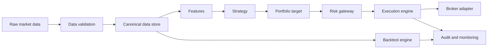

# EA Quant Trading System Architecture

## 1. 设计目标

EA 的目标是成为一个长期运行、持续迭代的量化交易系统，而不是一次性脚本。系统必须先具备工程可靠性，再逐步追求策略收益。

核心目标：

- 可复现：每次回测、纸交易、实盘决策都能追踪到代码 commit、配置、数据版本和参数。
- 可审计：信号、组合目标、风控决策、订单、成交、持仓变更都有日志与 run id。
- 可扩展：数据、策略、风控、broker、存储、监控都通过接口替换。
- 可风控：所有订单必须经过独立风控层；默认 paper/dry-run，实盘需要显式开启。
- 可迁移：先使用 Python-first 单仓库实现薄内核，未来可接入 NautilusTrader、LEAN、vn.py 或专用执行引擎。

## 2. 参考框架与借鉴边界

| 框架 | 借鉴内容 | 不直接照搬的原因 |
|---|---|---|
| QuantConnect LEAN | Universe / Alpha / Portfolio / Risk / Execution 分层，Reality Modeling | .NET/C# 栈较重，二开成本高 |
| NautilusTrader | 研究、仿真、实盘共享事件语义，生产级订单模型 | Rust/Python 混合复杂，API 仍活跃演进 |
| vn.py | Gateway、事件引擎、风控模块、国内市场接口生态 | 偏交易终端/接口平台，研究流水线需补强 |
| Freqtrade | dry-run/live、配置、Docker、WebUI/Telegram、bot 运维 | crypto bot 假设较强，不泛化为全资产核心 |
| vectorbt | 研究阶段高速参数扫描、robustness 检查 | 不适合作为实盘执行核心 |
| Backtrader / Zipline Reloaded | 策略 API、数据 feed、回测 CLI、bundle 思路 | 新项目不宜依赖其作为生产核心 |

## 3. 目标数据流

## 4. 领域对象

第一阶段需要稳定的最小领域对象：

- `Instrument`：标的、交易所、币种/货币、交易日历、最小价格单位。
- `Bar` / `Tick`：标准行情数据，明确时区和数据源。
- `Signal`：策略产生的方向、强度、置信度和元数据。
- `PortfolioTarget`：组合层目标仓位，不等于订单。
- `OrderIntent`：经过组合构建后的下单意图。
- `Order`：执行层订单，包含状态机。
- `Fill`：成交回报。
- `Position`：持仓快照。
- `Account`：现金、权益、保证金、可用资金。
- `RiskEvent`：风控拦截、降仓、熔断、kill switch。

## 5. 模块边界

| 模块 | 职责 |
|---|---|
| `core` | 领域模型、事件、时间、资产标识、错误类型 |
| `config` | YAML/TOML 配置、Pydantic 校验、环境变量、密钥引用 |
| `data` | 数据接入、清洗、质量检查、存储、数据目录 |
| `features` | 因子、指标、特征工程、特征缓存 |
| `strategy` | 策略接口、信号生成、调仓目标 |
| `portfolio` | 组合构建、资金分配、持仓账本、绩效归因 |
| `backtest` | 事件驱动回测、撮合、滑点、手续费、报告 |
| `paper` | 纸交易运行模式 |
| `execution` | OMS、订单路由、订单状态机、成交回报、对账 |
| `brokers` | IBKR、Binance、OKX、ccxt、FIX 等适配器 |
| `risk` | 盘前/盘中/盘后风控，限仓、限损、限频、熔断、kill switch |
| `monitoring` | 日志、指标、告警、交易状态、心跳、审计 trail |
| `experiments` | 实验记录、参数、数据版本、模型版本 |
| `cli` | `ea data/backtest/paper/live/report/doctor` 等命令 |

## 6. 阶段性落地

### Phase 0：工程地基

- README、架构文档、ADR。
- Python 项目配置、测试框架、lint/typecheck。
- GitHub remote、首次 commit、CI。
- CLI 骨架：`ea doctor`。

### Phase 1：回测 MVP

- 本地 OHLCV 数据导入。
- 标准数据 schema 与质量检查。
- 简单事件驱动回测器。
- 样例策略：buy-and-hold、moving-average crossover。
- 固定 fixture 的黄金样例测试。

### Phase 2：可信回测

- 手续费、滑点、成交延迟、部分成交。
- 样本内/样本外、walk-forward、参数扫描。
- 实验追踪与 run id。
- 风险报告、回撤、换手、交易列表。

### Phase 3：纸交易

- 真实行情或模拟行情 adapter。
- `PaperBroker` 复用 OMS、风控、监控。
- 心跳、断线重连、订单状态审计。
- 每日对账报告。

### Phase 4：小额实盘

- 只接入一个真实 broker/exchange。
- 最大订单金额、最大持仓、最大日亏损、最大下单频率。
- Kill switch 与异常自动暂停。
- broker 持仓与本地账本对账。

## 7. 最早验证的风险点

- 数据质量：缺失、复权、拆股、成交量异常、时区错误。
- 未来函数：特征、调仓、财报发布时间是否穿越。
- 幸存者偏差：股票池历史成分是否真实。
- 成交模型：滑点、手续费、盘口深度、部分成交是否合理。
- 研究/实盘偏差：同一策略在不同模式下是否输出同样订单意图。
- 参数过拟合：是否有样本外和 walk-forward。
- 订单状态机：撤单、拒单、部分成交、重复回报是否可处理。
- 风控失效：kill switch 是否独立于策略。
- API 稳定性：限频、断线、延迟、重连。
- 审计与对账：每次信号、订单、成交、持仓变更是否可追溯。

