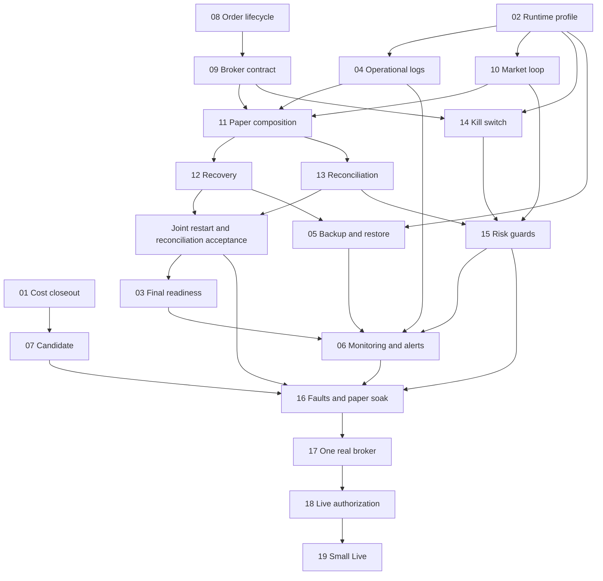

# EA PERSONAL PRODUCTION V1

## MISSION

Run one validated strategy on one real server and eventually one personal real account,
with observable, recoverable, auditable and stoppable operation. PPV-00 is inspection and
planning only. This document is the canonical bounded PPV plan, linked from ROADMAP;
STATUS remains the current product-state authority. Nothing here activates Paper, Live,
deployment, credentials, publication or external orders. Later units require explicit authorization.

## PPV-01 execution-cost contract

PPV-01 closes deterministic research execution costs. When read from merged main with
passing required CI, the delivered state is COMMISSION=SATISFIED, SLIPPAGE=SATISFIED,
LATENCY=SATISFIED, LIQUIDITY=DEFERRED. A branch copy is a candidate, not delivery evidence.

- Commission: explicit deterministic bps, calculated once per Fill from its actual execution
  price and currency-quantized half-even; existing ledger and formal reports retain after-fee economics.
- Slippage: optional fixed adverse bps in [0,10000); buy adds and sell subtracts the absolute
  close-based adjustment, then nearest-tick rounding with adverse ties. Small adjustments can
  round to the same price. See [ADR 0044](adr/0044-deterministic-adverse-slippage-v1.md).
- Latency: optional strict integer `latency_ms` in [0,86400000]. The first otherwise eligible
  initial raw bar must have event time strictly after original submission availability plus
  latency; equality is skipped. The delayed close supplies the slipped Fill price and commission
  base. Latency is not a fee or strategy entry delay. See [ADR 0045](adr/0045-deterministic-execution-latency-v1.md).
- Omitted options preserve historical identities. Explicit zero preserves economics but records
  a distinct assumption. Canonical scenario/policy identities, frozen Web inputs, audit, report
  verification and supported resume retain the cost contract; invalid configuration is rejected.
- Liquidity is explicitly DEFERRED: historical matching fills the entire order at the eligible
  bar-based price without volume participation, partial fills, market impact or venue simulation.
  This does not establish Paper or Live execution realism. If no bar qualifies, existing expiry
  semantics apply: entry-required V1 fails without a success report; bounded V4/V5 retains actual
  no-trade/open-position economics without a forced fill or exit.

Acceptance evidence: `tests/unit/test_commission.py`, `test_slippage.py` and
`test_execution_latency.py` cover exact costs, zero/nonzero/boundary timing, combined after-fee
results, invalid inputs, identity binding, fractional settlement, deterministic recovery and
frozen research inputs. Installed browser flows in `apps/web/e2e/local-backtest.spec.ts` exercise
formal results, refresh and download. Required CI and delivery evidence belong to the PR.
Candidate, Paper/Live, broker and advanced execution realism remain deferred. PPV-02 below adds only the runtime profile.

## PPV-02 production runtime contract

When read from merged main with required validation/CI passing, PPV-02 is SATISFIED at the
repository-delivery boundary. The [Production Runtime Profile](production-runtime.md) provides
one pinned existing bundle, strict explicit configuration, persistent external inputs/workspace,
and one systemd-supervised loopback offline research service. The launcher verifies commit,
manifest/payload hashes and the noneditable installed EA bytes, then execs the existing Web CLI.
Systemd enables boot eligibility and bounded failure restart; operator stop stays stopped.

Activation stops the single writer, explicitly changes the pinned release/configuration, and
retains workspace. Rollback requires established state-format compatibility; unknown compatibility
leaves the service stopped. PPV-01/02 installed acceptance asserts identical EA package bytes and
reopens the same completed formal report after restart, activation and rollback without state
rewrite. No generalized migration or recovery mechanism is added.

Evidence: `tests/unit/test_production_runtime.py`, `scripts/accept_production_runtime.py`, and
`Production runtime acceptance / installed-systemd` CI on the delivery PR. The Linux CI test
exercises the actual service manager, failure restart limit and enablement. A target VPS has not
been provisioned or reboot-tested: HOST_VALIDATION=NOT_YET_HOST_VERIFIED. No actual deployment,
public exposure, Paper/Live, broker, monitoring, backup or later PPV unit is authorized by delivery.
See [ADR 0046](adr/0046-production-runtime-profile-v1.md).

## CURRENT_BASELINE

Inspected 2026-09-23 (Asia/Shanghai).

- CURRENT_MAIN_SHA: `6fe950c435ac7b820f7b0587f2ccdd3e310e982c`.
- Local main and `git ls-remote origin refs/heads/main` agreed.
- Initial checkout: `/Users/mo/Documents/EA`; CURRENT_BRANCH: `main`;
  WORKTREE_STATUS: clean (`git status --short` empty, including untracked files).
- Writer: root Codex only; planning worktree `/Users/mo/Documents/EA-ppv-00`;
  branch `codex/ppv-00-baseline`; exact base is the SHA above; tier T0.
- Allowed changes: this document and its ROADMAP link. No runtime, tests, configuration,
  Accepted ADRs or other worktrees changed. Merge order: independent documentation change;
  recheck the baseline if other delivery merges first. No implementation PR chain.
- Existing main CI: [successful run 35500232342](https://github.com/jayjcc8-cloud/ea-quant/actions/runs/35500232342).
  This is baseline CI, not CI for the new documentation.
- Open metadata inspected: [#208 Candidate](https://github.com/jayjcc8-cloud/ea-quant/issues/208),
  [#212 slippage](https://github.com/jayjcc8-cloud/ea-quant/issues/212),
  [#214 latency](https://github.com/jayjcc8-cloud/ea-quant/issues/214).
  [PR #213](https://github.com/jayjcc8-cloud/ea-quant/pull/213) is OPEN at
  `198bce905646b1754050d89fa6a86c829bbc7f48`, with its applicable CI successful.
  It is not main capability. Candidate and latency have separate local worktrees;
  neither their presence nor Issue bodies prove delivery. No existing PPV Issue or canonical
  production plan was found in the inspected open issues and tracked documentation.
- User-provided PPV-00 request supplies this task's acceptance criteria. No Issue/PR was
  created or changed remotely by this inspection.

## GOALS

One strategy, one server, one account, one broker; deterministic research evidence before
selection; shared trading semantics; durable state with bounded recovery; explicit safety
controls; evidence-backed Paper, Small Live and long-running validation.

## NON_GOALS

Multi-tenant SaaS, billing, subscriptions, organizations/teams, complex RBAC, arbitrary Python
SaaS sandbox, a second broker, a multi-broker platform or generic broker framework, Kubernetes,
horizontal scaling, multi-region, optimizer platform, AI strategy generation, large agent
research platform, marketplace, public API, mobile app, complex market-impact/liquidity
simulation, unrelated metrics and architecture cleanup are DEFERRED. Existing compatibility
is preserved. Scope test: does it materially help Paper → Small Live → long-running personal
production validation? If not, defer.

## ARCHITECTURE_CONSTRAINTS

Reuse Strategy → Portfolio → Risk → Order/Fill → Ledger → Reconciliation, with Audit and
Recovery at their existing boundaries. [ADR 0003](adr/0003-shared-runtime-ports-and-adapters.md)
and [architecture](architecture.md) require a shared order-producing path, not a second engine.
[ADR 0027](adr/0027-phase1-offline-backtest-product-boundary.md) limits the currently exposed
product to offline execution and supported recovery frontiers. New production exposure needs
an explicitly authorized bounded change and any necessary superseding ADR; this plan does not
rewrite Accepted history. Research Candidate acceptance must never grant execution permission.

## Evidence index

All relative file references below refer to the pinned main tree. Test references demonstrate
existing executable coverage inspected as source; PPV-00 does not claim those suites were rerun.
Absence findings combine the tracked file inventory, CLI/routes, composition and source search;
future-facing names or enums alone are not operational implementations.

| ID | Concrete implementation and test evidence |
|---|---|
| E1 | [commission](../src/ea/core/commission.py), [scenario](../src/ea/product/scenario.py), [matcher](../src/ea/execution/matcher.py), [commission tests](../tests/unit/test_commission.py). Matcher issues full order quantity at quantized eligible bar close with policy-bound fees; no slippage/latency configuration or volume participation on this main. |
| E2 | [holdout](../src/ea/web/holdout.py), [Web service](../src/ea/web/service.py), [holdout tests](../tests/unit/test_web_holdout.py): frozen source/target relationships, formal report comparison, durable input snapshots. |
| E3 | [packages](../src/ea/strategy/package.py), [registry](../src/ea/strategy/registry.py), [identity](../src/ea/product/identity.py), [manifest](../src/ea/experiments/manifest.py), [local repeated strategy tests](../tests/unit/test_local_bounded_round_trips_v1.py): artifact hashes, parameters, lineage and versioned reports. |
| E4 | [distribution builder](../scripts/build_distribution.py), [bundle instructions](distribution-bundle.md), [CLI](../src/ea/cli/app.py), [server](../src/ea/web/server.py): fixed-commit export, wheel/Web/hash manifest; only loopback Uvicorn, no service manager or deploy profile. |
| E5 | [Web service](../src/ea/web/service.py): `WorkspaceLease` uses flock; jobs/inputs/runs/reports persist, interrupted jobs remain interrupted. [Store](../src/ea/experiments/store.py), [audit journal](../src/ea/experiments/audit.py), [resume tests](../tests/unit/test_backtest_resume.py): durable funding, dispatch, terminal frontiers and corruption refusal. |
| E6 | [Web app](../src/ea/web/app.py) `/api/health` returns service/version/offline flags; [CLI](../src/ea/cli/app.py) doctor is local diagnostics. Neither checks a live feed, broker or recovered runtime readiness. |
| E7 | [historical runtime](../src/ea/runtime/historical.py), [historical source](../src/ea/data/historical_runtime.py), [coordinator](../src/ea/runtime/coordinator.py), [queue](../src/ea/runtime/queue.py): deterministic historical admission/sequencing, not wall-clock feed operation. |
| E8 | [execution authority](../src/ea/execution/authority.py), [fact authority](../src/ea/execution/fact_authority.py), [messages](../src/ea/core/execution_messages.py), [projection](../src/ea/core/execution_state.py), [fact tests](../tests/unit/test_execution_fact_authority.py): client keys, dedup, partial/terminal projections, cancellation/rejection facts and STILL_UNKNOWN query outcomes. Tests include partial terminal quantities, late trades and unresolved query results. No broker transport/query adapter. |
| E9 | [risk authority](../src/ea/risk/authority.py), [risk values](../src/ea/core/risk.py), [authorization](../src/ea/runtime/authorization.py), [risk tests](../tests/unit/test_risk_authority.py): quantity/position bounds, monotone halt, fresh approvals and global/instrument halt checks. Product scenario supplies cash/notional limits. No operator-facing strategy/account/global kill controls. |
| E10 | [ledger](../src/ea/portfolio/ledger.py), [ledger authority](../src/ea/portfolio/ledger_authority.py), [reconciliation](../src/ea/reconciliation/authority.py), [backtest](../src/ea/product/backtest.py), [recovery](../src/ea/runtime/_coordinator_recovery.py): economic dedup, audit-gated effects, reconciliation failure and bounded historical recovery. No external account poll/reconnect loop. |
| E11 | [settings](../src/ea/config/settings.py) rejects LIVE via `reject_unavailable_live_mode`; PAPER and PRODUCTION enum values do not implement an executable profile. [Settings tests](../tests/unit/test_settings.py). |
| E12 | [audit contract](../src/ea/core/audit.py), [audit journal](../src/ea/experiments/audit.py), [audit tests](../tests/unit/test_audit_journal.py), [resume tests](../tests/unit/test_backtest_resume.py): structured economic evidence, persistence-failure injection and failure artifacts, not operational logging/alerting/soak tooling. |
| E13 | [CI](../.github/workflows/ci.yml), [candidate CI](../.github/workflows/candidate-full.yml), [CONTRIBUTING](../CONTRIBUTING.md): docs-focused governance checks, quality, installed smoke and Web acceptance; no production deployment, backup, restore, monitoring or soak jobs. |
| E14 | [Proposed ADR 0039](adr/0039-strategy-lifecycle-and-research-candidate-identity-v1.md), [lifecycle review](reviews/STRATEGY_LIFECYCLE_ARCHITECTURE_REVIEW_V1.md), E2/E3: source/Holdout evidence exists; no persisted Candidate runtime/routes on main. |

## CURRENT_CAPABILITY_MATRIX

SATISFIED means delivered for the explicitly stated scope, not server/live readiness. PARTIAL
means reusable implementation exists but the named production capability is incomplete. MISSING
means no operational implementation was found. DEFERRED marks excluded scope, NOT_APPLICABLE
would mark a capability irrelevant to this mission; none of the requested capabilities is N/A.

### Research foundation

| Capability | Status | Evidence and precise boundary |
|---|---|---|
| commission | SATISFIED | E1: deterministic per-Fill fees and after-fee reports. |
| slippage | MISSING | E1; #212/#213 remain unmerged. |
| latency | MISSING | E1/E7; strategy entry delay is not execution latency; #214 open. |
| liquidity assumptions | PARTIAL | E1: explicit full-fill bar-close behavior, no volume cap/partial matching; bound and document credible assumptions before candidate validation. |
| holdout | SATISFIED | E2: chronological evaluation, not statistical proof of profitability. |
| comparison | SATISFIED | E2: persisted formal results and currency-aware deltas. |
| candidate lifecycle | MISSING | E14: proposed design and open #208, no delivered record/decision path. |
| strategy package/version identity | SATISFIED | E3: frozen artifacts and canonical parameters. |
| reproducibility | SATISFIED | E3/E5: offline lineage, semantic identity and supported replay. |

### Server productionization

| Capability | Status | Evidence and precise boundary |
|---|---|---|
| production deployment | MISSING | E4/E11/E13: installable local bundle, no server deployment profile. |
| fixed-version deployment | PARTIAL | E4: pinned distribution exists; server install/activation procedure missing. |
| persistent workspace | SATISFIED | E5: local single-writer persisted workspace; server volume setup remains PPV-02. |
| persistent runtime state | PARTIAL | E5/E10: offline journals/frontiers; no continuous session/outbound broker state. |
| restart policy | MISSING | E4/E5: interrupted Web jobs do not auto-resume; no process supervisor policy. |
| boot-time startup | MISSING | E4/E13: no service unit/startup installation. |
| rollback | PARTIAL | E4: fixed artifacts available; compatible-state rollback procedure unproved. |
| health | PARTIAL | E6: static local service probe only. |
| readiness | MISSING | E6: no dynamic recovered-state/feed/broker gate. |
| structured logging | PARTIAL | E12: canonical audit exists, no correlated operational JSON log contract. |
| monitoring | MISSING | E6/E13: no operational signal collection/dashboard. |
| alerts | MISSING | E12/E13: no alert delivery/acknowledgement path. |
| backup | MISSING | E5/E13: persistence is not a consistent backup procedure. |
| restore | MISSING | E5/E13: same-attempt resume is not backup restore. |

### Trading runtime

| Capability | Status | Evidence and precise boundary |
|---|---|---|
| real-time market event loop | PARTIAL | E7: reuse event contracts/queue, add wall-clock feed admission and disconnect handling. |
| market heartbeat | MISSING | E7: no runtime feed heartbeat/deadline. |
| stale-market detection | MISSING | E7/E9: historical visibility and stale approval checks are not wall-clock quote freshness. |
| broker contract | PARTIAL | E8: canonical facts/client identity exist; concrete submit/cancel/query capability boundary absent. |
| paper broker | MISSING | E1/E11: historical matcher and PAPER enum are not a continuous paper adapter. |
| order lifecycle | PARTIAL | E8: substantial canonical projection exists; operational command/timeout integration absent. |
| client order id / idempotency | PARTIAL | E8/E10: internal client keys/dedup; broker mapping and uncertain-send retries unproved. |
| partial fills | PARTIAL | E8: quantities/projections/ledger facts; E1 matcher emits full fills only. |
| cancel/reject semantics | PARTIAL | E8: canonical facts/projections; no broker cancel request/race path. |
| UNKNOWN order semantics | PARTIAL | E8: unresolved and STILL_UNKNOWN evidence; no external ambiguity-resolution workflow. UNKNOWN is not a delivered standalone projection state. |
| runtime recovery | PARTIAL | E5/E10: bounded offline frontiers; no broker-aware restart from arbitrary operational interruption. |
| broker reconciliation | PARTIAL | E10: shared reconciliation authority; no broker snapshot/query/reconnect adapter. |

### Production safety

| Capability | Status | Evidence and precise boundary |
|---|---|---|
| strategy kill switch | PARTIAL | E9: halt primitive; no scoped durable operator control. |
| account kill switch | MISSING | E9/E11: no operational account scope/control. |
| global kill switch | PARTIAL | E9: global halt freshness gate; no persistent operator activation/restart protocol. |
| max daily loss | MISSING | E9: no day-bound realized/unrealized loss budget. |
| max exposure | PARTIAL | E9/E10: position/notional/cash bounds; live outstanding-order/account exposure not integrated. |
| max open orders | MISSING | E9: offline bounded strategies are not an operational outstanding-order guard. |
| order-rate guard | MISSING | E9: no rate-window limiter. |
| price deviation guard | MISSING | E1/E9: quantization is not price-reference deviation enforcement. |
| market stale guard | MISSING | E7/E9: no wall-clock stale feed interlock. |
| broker disconnected guard | MISSING | E8/E11: no broker connection state. |
| reconciliation mismatch guard | PARTIAL | E9/E10: offline halt/failure; no live reconciliation-to-submission gate integration. |
| strategy heartbeat guard | MISSING | E7/E9: no strategy liveness deadline. |
| fail-closed behavior | PARTIAL | E5/E9/E10/E11: delivered offline denial/corruption refusal; broker uncertainty and operational failures unvalidated. |

### Live validation

| Capability | Status | Evidence and precise boundary |
|---|---|---|
| paper soak capability | MISSING | E7/E11/E13: no running paper product or timed evidence harness. |
| fault injection | PARTIAL | E12: deterministic unit-level audit/recovery faults, no feed/broker/process campaign. |
| real broker integration | MISSING | E8/E11: no vendor adapter. |
| explicit live authorization | PARTIAL | E11 and WORKFLOW: human authorization required and LIVE denied; no account/artifact/limits-bound enabling mechanism. |
| small-live workflow | MISSING | E11/E13: no staged operational workflow/runbook. |
| production evidence retention | PARTIAL | E5/E12: durable local research evidence; no production retention/capacity/backup policy. |
| incident evidence | PARTIAL | E12: classified failures; no incident capture/timeline and operator action record. |

## PPV-01 ... PPV-19 STATUS

The PPV-00 inspection below is historical; PPV-01 is satisfied by its merged execution-cost
contract and passing delivery evidence above. Reuse the satisfied research
capabilities above; do not rebuild commission, holdout, comparison, identity or local persistence.
Dependencies below are closure prerequisites; bounded design may begin before all are delivered.

| Work unit | STATUS | CURRENT_EVIDENCE | REMAINING_GAP | DEPENDENCIES | RECOMMENDED_SCOPE |
|---|---|---|---|---|---|
| PPV-01 Execution Cost Closeout | SATISFIED | #213; #214; ADRs 0044/0045; execution-cost contract above | Liquidity explicitly DEFERRED | Existing research | Deterministic commission, slippage and latency; stop research realism expansion |
| PPV-02 Production Runtime Profile | SATISFIED | #218; ADR 0046; runtime contract above | Target VPS deployment/boot acceptance NOT_YET_HOST_VERIFIED | Existing bundle and offline Web | One supervised loopback service, persistent workspace, explicit compatible activation/rollback |
| PPV-03 Health & Readiness | PARTIAL | E6 | Dynamic fail-closed readiness | 02; final feed/recovery/broker signals from 10/12/13 | Distinguish alive from permitted to trade |
| PPV-04 Structured Logging | PARTIAL | E12 | Operational event schema/correlation/rotation | 02, existing audit IDs | Reuse RunId/order/fact IDs; preserve audit authority and redact secrets |
| PPV-05 Backup & Restore | MISSING | E5/E13 | Consistent snapshot, retention, isolated restore and integrity checks | 02; final runtime persistence 12 | Quiesced or proven consistent backup, restore drill; no state repair |
| PPV-06 Monitoring & Alerts | MISSING | E6/E13 | Signals, thresholds, delivery and alert test | 03/04/05; 13/14/15 operational states | One operator/channel; actionable liveness, reconciliation, disk and backup alerts |
| PPV-07 Candidate V1 | PARTIAL | E2/E3/E14; #208 | Immutable evidence-bound candidate and human terminal decision | 01 for final strategy validation; existing source/Holdout | Continue #208 under its existing repair decision; no new candidate engine or auto-promotion |
| PPV-08 Order Lifecycle V1 | PARTIAL | E8 | Operational cancel/timeout/ambiguity and partial-fill integration | Existing order/fact authorities | Extend existing semantics; preserve late facts and dedup; no new OMS |
| PPV-09 Broker Contract V1 | PARTIAL | E8 | Bounded submit/cancel/query, client mapping and normalized failures | 08 | Narrow contract for one intended broker and paper adapter; no generic framework |
| PPV-10 Market Event Loop | PARTIAL | E7 | Real-time feed, heartbeat, freshness, reconnect | 02/04; shared historical event contracts | One feed/instrument; preserve admission/time visibility and ordering |
| PPV-11 Paper Trading Runtime | PARTIAL | E1/E7/E10/E11 | Continuous paper composition/adapter | 08/09/10; operational start also 12/13/14/15 | Shared owners and paper transport; no historical-backtest-as-soak claim |
| PPV-12 Runtime Recovery V1 | PARTIAL | E5/E10 | Durable outbound intent and uncertain-effect restart | 08/09/11; acceptance with 13 | Query/reconcile before new submissions; never blindly resend ambiguous orders |
| PPV-13 Broker Reconciliation V1 | PARTIAL | E10 | External observations and continuous drift handling | 08/09/11; restart integration with 12 | Orders/fills/cash/positions; detect, retain and halt, no automatic balance repair |
| PPV-14 Kill Switch | PARTIAL | E9 | Operator strategy/account/global scopes and durable restart behavior | 02/08/09 | Reuse halt authorization seam; define pending orders and cancel semantics; no implicit liquidation |
| PPV-15 Production Risk Guards | PARTIAL | E9/E10 | Daily loss, exposure/open orders/rate/deviation/freshness/connectivity/liveness | 08/10/13/14 | Enforce immediately before outbound effects, retain reasons, test each guard |
| PPV-16 Fault Injection + Paper Soak | PARTIAL | E12 | Integrated faults and timed 72h/7d evidence | 01–15 complete for chosen path, including Candidate | Disconnect, duplicate/late facts, uncertain sends, crash, disk/audit failure, restart/restore |
| PPV-17 One Real Broker | MISSING | E8/E11 | One vendor adapter and integration proof | 09/12/13/15/16 | Select one broker/account/instrument; offline fixtures first; connectivity/secrets separately authorized |
| PPV-18 Explicit Live Authorization | PARTIAL | E11/WORKFLOW | Explicit bounded enablement with deny-by-default | 07/14/15/16/17 | Bind approval to account, candidate/artifact, limits, expiry and revocation; no permission from Candidate |
| PPV-19 Small Live V1 | MISSING | E11/E13 | Small-capital supervised workflow and operational evidence | 02–18 relevant closure and explicit owner approval | One strategy/account; finite limits, stop/recovery runbook; Gates C/D, no capital escalation by automation |

## DEPENDENCY_GRAPH

## EXECUTION_ORDER

1. **Next: PPV-01**, reconcile and close the already active execution-cost deliveries at exact
   merged SHAs. Current main lacks slippage and latency; Candidate's selected evidence should
   bind the final cost assumptions. Do not silently spend #208's repair budget or merge #213 here.
2. PPV-02 and PPV-04 establish process/storage/logging boundaries; PPV-07 can then finish the
   existing evidence selection path after PPV-01. This is not permission for parallel writers.
3. PPV-08 → PPV-09, then PPV-10 and PPV-11 composition. Select the intended broker's required
   semantics before freezing the narrow contract; defer real connectivity to PPV-17.
4. PPV-12 and PPV-13 are implemented against the same paper interface and close with one joint
   restart/reconciliation acceptance scenario. Neither can claim safe uncertain-send recovery
   from local replay alone. This is a shared acceptance dependency, not a circular build graph.
5. PPV-14 → PPV-15 before sustained paper operation. PPV-03 may start with local health earlier,
   but readiness closes only when actual recovery/feed/reconciliation gates exist. PPV-05 closes
   against the final persistent runtime layout. PPV-06 closes after those operational signals.
6. PPV-16 faults and Gates A/B in Paper → PPV-17 → PPV-18 → explicitly authorized PPV-19.
   Adaptation to the real broker must repeat relevant recovery/guard/reconnect evidence before
   live enables. Gate C and D continue in the explicitly approved small-live environment.

The numeric listing is not a strict execution sequence: completing monitoring/readiness before
runtime state exists would only prove placeholders. Existing full-fill historical matching cannot
stand in for Paper, and shared reconciliation cannot stand in for a broker poller.

## PRODUCTION_GATES

Future evidence only; no soak, server deployment, connectivity or live gate executed by PPV-00.
Each run records exact code/bundle/candidate/config identities, mode, account reference (no
secrets), time interval, alerts/incidents, restart/reconciliation evidence and operator decision.
Paper evidence does not prove broker-specific Live safety. A failed or interrupted gate is
retained and does not silently become a pass; any rerun has a distinct evidence interval.

| Gate | Minimum target evidence |
|---|---|
| A — 72h | No unexplained crash, no corrupted state, no duplicate economic effect; restart recovery works; reconciliation remains healthy. |
| B — 7 days | Automatic restart works; daily backup works; alerts work; logs explain every order; reconciliation remains healthy; no manual database/file repair. |
| C — 30 days | No manual internal-state edits; all incidents recorded; VPS reboot recovery verified; broker reconnect verified; no duplicate economic effects; backup restore verified. |
| D — 90 days | Sustained evidence supporting `PERSONAL_PRODUCTION_VALIDATED = TRUE`, with A–C evidence retained and explicit owner acceptance. Elapsed time alone does not set this flag. |

TRUE P0 gaps are scoped to the next boundary: before credible strategy selection, finish cost
assumptions and candidate evidence; before Paper soak, close supervision/state, feed, broker
contract/paper composition, recovery/reconciliation, kill/guards and operational evidence;
before Small Live, one broker integration and explicit authorization. Commercial features are
not P0. Host/provider, broker, capital and numerical limits are future unit inputs, not blockers
to PPV-00 or permission to choose accounts/resolve secrets now.

## DEFERRED_SCOPE

All NON_GOALS remain deferred. Broader metrics, automatic reconciliation corrections, exhaustive
dormant recovery combinations, multiple strategies/accounts and optimizer work are not gates.
Preserve existing compatibility without activating these features. Any additional requirement
must pass the mission scope test and be separately authorized.

## PPV-00 validation boundary

Only documentation changes are allowed. Validate relative links, required capability/work-unit
coverage, diff whitespace and scoped changed paths; run the CI-selected documentation checks
from CONTRIBUTING (`test_project_control.py` and `test_governance_protocol.py`). No product
acceptance, deployment, Paper/Live, long-duration gate or release is executed. A local validated
planning artifact is distinct from merged documentation with green CI. Stop after PPV-00.

Local validation: the two CI-selected governance test files passed (14 tests). All relative
links, required sections, 55 capability rows and 19 work-unit rows passed the document check;
diff whitespace passed. The initial check incorrectly expected 58 capabilities; recounting the
request confirms 55, and the corrected check passed. No product suites or production gates
were run. Remote main was rechecked unchanged after writing. Remote documentation CI/merge
is not claimed; the planning changes are local only.
