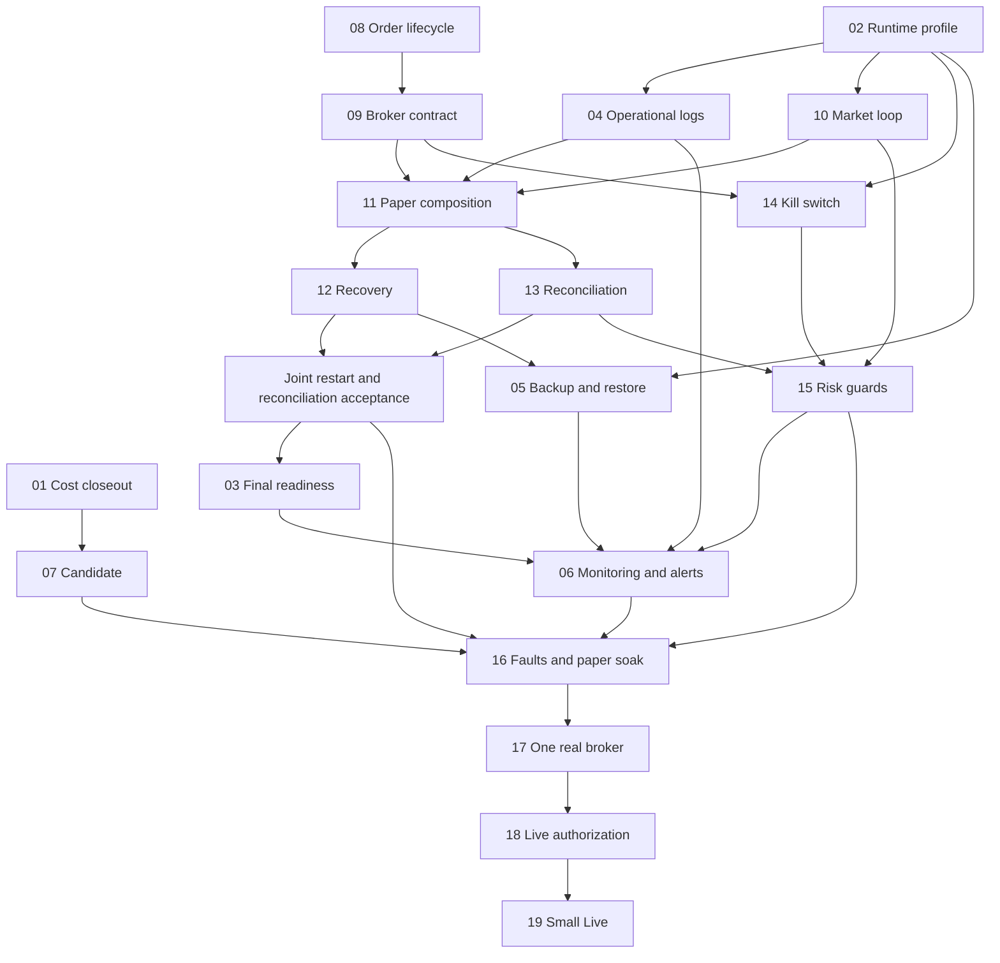

# EA PERSONAL PRODUCTION V1

## MISSION

Run one validated strategy on one real server and eventually one personal real account,
with observable, recoverable, auditable and stoppable operation. PPV-00 is inspection and
planning only. This document is the canonical bounded PPV plan, linked from ROADMAP;
STATUS remains the current product-state authority. Delivery and local acceptance do not imply
host validation or Live authorization. Deployment, credentials, publication and external orders
remain outside the authorization below.

## Personal Production V2 Phase A

The Product Owner authorized sequential PPV-04 → PPV-07 → PPV-08 → PPV-09 → PPV-10 → PPV-11
delivery. Phase A is COMPLETE: `main` provides a real Mac-local continuous Paper runtime using a
simulated feed and Paper broker, an explicitly accepted candidate, existing
strategy/risk/portfolio/ledger authorities and correlated operational logs. Accepted candidate
status alone grants no execution permission.

REPO_DELIVERY, LOCAL_ACCEPTANCE, HOST_VALIDATION and LIVE_AUTHORIZATION are distinct claims.
VPS_DEPLOYMENT=DENIED; LIVE_ORDER_AUTHORIZATION=DENIED. VPS target-host validation is no longer a
development precondition; it verifies only host attributes after the product is proven on Mac and
one fixed artifact. Delivery now advances by maturity gates (see
[EXECUTION_ORDER](#execution_order)); PPV numbering no longer sets the sequence. Next work:
PPV-03/05/06 toward GATE M3.

## PPV-04 structured operational logging contract

When read from merged main with required validation/CI passing, Issue #220 delivers correlated
JSON operational logging over the existing deterministic scenario/simulator path. Reused economic
IDs connect market, strategy, risk, submission, execution fact, Fill, acknowledged portfolio and
reconciliation observations. Candidate/account context is nullable where no such identity exists.
Logs have no economic authority and sink failures cannot change economic behavior. See
[the event and identity contract](operational-logging.md); audit/ledger formats remain unchanged.

Acceptance uses focused logging contract/runtime tests and existing economic/resume regressions.
This is PPV-04 repository delivery, not the continuous Paper product gate.

## PPV-07 Candidate Lifecycle V1

When read from merged main with required validation/CI passing, Issue #208 delivers explicit
EVALUATED → ACCEPTED/REJECTED research decisions over exactly one successful source and its
selected chronological Holdout. Each immutable Candidate identity binds verified report/path,
normalized configuration, parameters, artifact and captured data. Terminal decisions require a
reason; exact retries preserve the original decision. Missing or changed evidence rejects loading.

The real `ea candidate inspect` and `ea candidate run` entries recheck accepted identity and
persisted evidence without starting the Web service. The run guard compares configuration before
executing any frozen strategy code, then uses the existing offline engine. Operational logs and a
`candidate-binding.json` sidecar retain the accepted identity. Acceptance alone does not authorize
Paper/Live execution. See [the Candidate usage contract](candidate-lifecycle.md) and
[ADR 0047](adr/0047-accepted-candidate-loading-v1.md). Continuous
PPV-11 provides the separate local Paper operation below.

## PPV-08 local Paper order command lifecycle

Issue #224 adds `OrderCommandTracker` over an existing issued Order and its client submission
identity. `begin_submit` reserves one transport attempt before any send; repeated calls return
no send command. Pending, submitted, definitely-not-submitted and uncertain results remain
distinct. A timeout or unknown query never permits blind resubmission, even if a later query
proves that the original request was not submitted.

Cancellation has its own single request and transport outcome. A request or accepted transport
return does not cancel the Order: only the existing execution-fact authority can confirm that
projection. Existing acknowledgement, rejection, partial/full Fill, expiry and cancellation
semantics remain authoritative. Late trades after a terminal projection retain their Fill and
reconciliation/halt evidence; duplicate facts do not create another economic effect.

Direct tests use the existing Order/fact authorities and funded ledger, including independent
cash, position and sequence expectations. The tracker owns no risk permission, Fill, balance or
durable recovery state. Runtime composition must still authorize immediately before transport;
an unknown process state must fail closed, without recreating a tracker to resend. The next
work unit is PPV-09's local Paper adapter below; PPV-11 supplies the continuous product entry.

## PPV-09 local Paper broker contract

Issue #227 adds `PaperBrokerPort` and one in-process `PaperBroker` over actually issued Orders
and PPV-08 submit/cancel commands. Exact request retries return retained results; conflicting
identities reject. Missing current-run history returns unknown, never proof that a request was
not sent. Transport outcomes distinguish definite no effect from an uncertain/lost response.
Only the existing fact authority changes Order projections and creates Fills.

The adapter emits canonical acknowledgement, cancellation, query and trade facts. A query for a
filled Order redelivers its retained trade with the same dedup identity and a new ingress identity;
direct tests prove one Fill and one cash/position effect. The adapter is also the read-only source
issuance verifier for those exact bytes. Retention is bounded to at most 1,024 submit requests,
the same bound for unknown cancellation results, and eight times the configured request limit
in ingress deliveries; capacity exhaustion rejects safely. An unknown cancellation retains its
original result even if a delayed submit arrives, so retrying cannot acquire a new effect.

Matching uses the first newly admitted raw event strictly after submission plus configured
latency, with existing adverse slippage, tick rounding and commission arithmetic. It fills the
whole Order; volume participation and simulated partial fills are not claimed. Cancellation
stops a pending local match and emits separate confirmation evidence. The adapter owns no second
Fill, ledger, cash or position authority and grants no pre-effect permission. PPV-11 composes
freshness/risk admission, audit and the existing ledger path. State is process-local: crash recovery,
real provider semantics, network connections and account credentials remain unsupported.

## PPV-10 local market event loop

Issue #230 adds `StreamingMarketRuntime` and an outer `LocalSimulatedMarketSource`. The inner
runtime receives one event at a time with one pending market slot and a configured finite fact
queue. It retains only the previous market envelope and current dispatch evidence; it does not
replay historical backtests or grow a market-history registry. The source generates a current
closed synthetic Bar per poll from a fixed price cycle, either for a finite count or until stop.

Injected UTC controls event visibility and age; injected monotonic time detects feed stalls.
Heartbeat alone never refreshes market freshness. Future events wait; duplicate, conflicting or
regressing market emissions reject. This local stream requires strictly increasing event times;
backfills and corrections at an older or equal Bar end are rejected. That restriction prevents
non-adjacent record replay with constant retained state. Freshness uses the market event time,
so a delayed old Bar cannot become fresh merely because it arrived now. Exhaustion and stale/stalled data stop new
market dispatch with an explicit reason.

Callbacks are serialized and receive a globally increasing dispatch sequence. The existing
StrategySignalAuthority accepts only the exact active market proof, and execution facts require
the bound source's exact issued bytes before the existing fact authority sees an active dispatch.
A callback-generated ACK may sort before its triggering market at the same timestamp: streaming
uses causal dispatch sequence across that boundary, rather than pretending all future roots were
available for historical pre-sorting. Fact visibility and market input ordering remain enforced.

The finite process smoke entry, from an environment with this package installed, is:

```bash
python -m ea.product.market_stream --events 20 --interval 0.1
```

It emits JSON market/heartbeat events and a final reason. Ctrl-C or SIGTERM requests a controlled
stop; the finite count exits with `source_exhausted`. Stop or a failed market callback closes new
market ingress and permits a bounded drain of already issued facts. A failed fact callback is
retained as incomplete and is not automatically retried or reported as a clean close, including
exit-class callback exceptions. The outer adapter releases the source on exit, including failure.

This entry has no strategy, account or economic effects. Full accepted-Candidate Paper operation,
durable audit and status/stop commands are delivered separately by PPV-11 below. There is no
provider connection, reconnect, crash recovery, external order write or long-duration claim.

## PPV-11 Mac-local Paper V1

Issue #232 / ADR 0049 delivers the explicit `ea paper start/status/stop` path for an ACCEPTED
Action V2 V4/V5 Candidate, one simulated account and instrument. It composes the preceding units
with the existing strategy, planning, risk, Order, execution-fact, Fill, ledger, reconciliation and
POSIX audit owners. See [copyable commands, examples and failure semantics](local-paper.md).

The process generates fresh local events until user stop or a declared source failure. Strategy
round trips remain bounded by accepted configuration; completion does not fake source exhaustion.
Current cash/notional and stop/freshness are checked at the durable submission boundary. Duplicate
query facts retain evidence without duplicate money. Observational status distinguishes published
balances from an observed Fill or incomplete internal advance. Stop releases the source/journal/
store lease and does not liquidate. Existing/unknown attempts cannot resume or resend.

This satisfies only the authorized Mac-local simulated product path. Installed acceptance uses a
fixed wheel outside Git and records its finite actual interval in the PR. External provider
compatibility, host operation, recovery and long-duration Paper gates remain unverified.

## PPV-01 execution-cost contract

PPV-01 closes deterministic research execution costs. When read from merged main with
passing required CI, the delivered state is COMMISSION=SATISFIED, SLIPPAGE=SATISFIED,
LATENCY=SATISFIED, LIQUIDITY=DEFERRED. A branch copy is a candidate, not delivery evidence.

- Commission: explicit deterministic bps, calculated once per Fill from its actual execution
  price and currency-quantized half-even; existing ledger and formal reports retain after-fee economics.
- Slippage: optional fixed adverse bps in [0,10000); buy adds and sell subtracts the absolute
  close-based adjustment, then nearest-tick rounding with adverse ties. Small adjustments can
  round to the same price. See [ADR 0044](adr/0044-deterministic-adverse-slippage-v1.md).
- Latency: optional strict integer `latency_ms` in [0,86400000]. The first otherwise eligible
  initial raw bar must have event time strictly after original submission availability plus
  latency; equality is skipped. The delayed close supplies the slipped Fill price and commission
  base. Latency is not a fee or strategy entry delay. See [ADR 0045](adr/0045-deterministic-execution-latency-v1.md).
- Omitted options preserve historical identities. Explicit zero preserves economics but records
  a distinct assumption. Canonical scenario/policy identities, frozen Web inputs, audit, report
  verification and supported resume retain the cost contract; invalid configuration is rejected.
- Liquidity is explicitly DEFERRED: historical matching fills the entire order at the eligible
  bar-based price without volume participation, partial fills, market impact or venue simulation.
  This does not establish Paper or Live execution realism. If no bar qualifies, existing expiry
  semantics apply: entry-required V1 fails without a success report; bounded V4/V5 retains actual
  no-trade/open-position economics without a forced fill or exit.

Acceptance evidence: `tests/unit/test_commission.py`, `test_slippage.py` and
`test_execution_latency.py` cover exact costs, zero/nonzero/boundary timing, combined after-fee
results, invalid inputs, identity binding, fractional settlement, deterministic recovery and
frozen research inputs. Installed browser flows in `apps/web/e2e/local-backtest.spec.ts` exercise
formal results, refresh and download. Required CI and delivery evidence belong to the PR.
Paper/Live, broker and advanced execution realism remain deferred at the PPV-01 boundary. PPV-02 below adds only the runtime profile.

## PPV-02 production runtime contract

When read from merged main with required validation/CI passing, PPV-02 is SATISFIED at the
repository-delivery boundary. The [Production Runtime Profile](production-runtime.md) provides
one pinned existing bundle, strict explicit configuration, persistent external inputs/workspace,
and one systemd-supervised loopback offline research service. The launcher verifies commit,
manifest/payload hashes and the noneditable installed EA bytes, then execs the existing Web CLI.
Systemd enables boot eligibility and bounded failure restart; operator stop stays stopped.

Activation stops the single writer, explicitly changes the pinned release/configuration, and
retains workspace. Rollback requires established state-format compatibility; unknown compatibility
leaves the service stopped. PPV-01/02 installed acceptance asserts identical EA package bytes and
reopens the same completed formal report after restart, activation and rollback without state
rewrite. No generalized migration or recovery mechanism is added.

Evidence: `tests/unit/test_production_runtime.py`, `scripts/accept_production_runtime.py`, and
`Production runtime acceptance / installed-systemd` CI on the delivery PR. The Linux CI test
exercises the actual service manager, failure restart limit and enablement. A target VPS has not
been provisioned or reboot-tested: HOST_VALIDATION=NOT_YET_HOST_VERIFIED. No actual deployment,
public exposure, Paper/Live, broker, monitoring, backup or later PPV unit is authorized by delivery.
See [ADR 0046](adr/0046-production-runtime-profile-v1.md).

## CURRENT_BASELINE

Inspected 2026-09-27 (Asia/Shanghai).

- CURRENT_MAIN_SHA: `afddf76291976306641a9b4dd10a85985c74e15c`.
- CURRENT_BRANCH: `main`; WORKTREE_STATUS: clean.
- PPV-11 = SATISFIED. Current capability = Mac-local continuous simulated Paper
  (`ea paper start/status/stop`), one accepted Action V2 V4/V5 Candidate, one simulated
  account/instrument, generated local feed, in-process Paper broker.
- M1 Crash-safe Paper = SATISFIED: PPV-12 Runtime Recovery + PPV-13 Broker Reconciliation +
  PPV-14 Kill Switch + resume-feed continuation. Journal-replay recovery reconstructs the
  economic gate, re-issued Orders, broker/tracker, refresh frontier and fact authority, then
  continues the feed with exactly-once fill replay. Kill switch (strategy/account/global,
  monotone halt) and broker reconciliation (MATCH/CONFLICT/UNKNOWN; halt, never auto-repair)
  are delivered for the local Paper path.
- M2 Operational-safe Paper = SATISFIED: PPV-15 Production Risk Guards. One
  ``OperationalSafetyAuthority`` gates every broker outbound effect through a single contract
  (kill switch, reconciliation, market freshness, broker health, strategy heartbeat, daily
  loss, exposure, open orders, order rate and price deviation), each ALLOW/DENY/HALT with a
  durable explainable reason. HALT resolves through the existing ``EXTERNAL_SAFETY_HALT``.
- External Paper provider, Live, VPS host verification, backup/restore,
  monitoring/alerting and long-duration soak are NOT AVAILABLE at this
  baseline. See [PRODUCT_BOUNDARY](#product-boundary).
- KNOWN_FLAKY: `test_multi_dispatch_resume[dispatch_durable-2]` (backtest filesystem st_nlink
  race; NON_BLOCKING; not introduced by the M1 Paper path).
- NEXT_PRODUCT_GATE = M3 (Self-operating Paper): PPV-03 + PPV-05 + PPV-06.

## GOALS

One strategy, one server, one account, one broker; deterministic research evidence before
selection; shared trading semantics; durable state with bounded recovery; explicit safety
controls; evidence-backed Paper, Small Live and long-running validation.

## NON_GOALS

Multi-tenant SaaS, billing, subscriptions, organizations/teams, complex RBAC, arbitrary Python
SaaS sandbox, a second broker, a multi-broker platform or generic broker framework, Kubernetes,
horizontal scaling, multi-region, optimizer platform, AI strategy generation, large agent
research platform, marketplace, public API, mobile app, complex market-impact/liquidity
simulation, unrelated metrics and architecture cleanup are DEFERRED. Existing compatibility
is preserved. Scope test: does it materially help Paper → Small Live → long-running personal
production validation? If not, defer.

## ARCHITECTURE_CONSTRAINTS

Reuse Strategy → Portfolio → Risk → Order/Fill → Ledger → Reconciliation, with Audit and
Recovery at their existing boundaries. [ADR 0003](adr/0003-shared-runtime-ports-and-adapters.md)
and [architecture](architecture.md) require a shared order-producing path, not a second engine.
[ADR 0027](adr/0027-phase1-offline-backtest-product-boundary.md) limits the currently exposed
product to offline execution and supported recovery frontiers. New production exposure needs
an explicitly authorized bounded change and any necessary superseding ADR; this plan does not
rewrite Accepted history. Research Candidate acceptance must never grant execution permission.

## Evidence index

All relative file references below refer to the pinned main tree. Test references demonstrate
existing executable coverage inspected as source; PPV-00 does not claim those suites were rerun.
Absence findings combine the tracked file inventory, CLI/routes, composition and source search;
future-facing names or enums alone are not operational implementations.

| ID | Concrete implementation and test evidence |
|---|---|
| E1 | [commission](../src/ea/core/commission.py), [scenario](../src/ea/product/scenario.py), [matcher](../src/ea/execution/matcher.py), [commission tests](../tests/unit/test_commission.py). Matcher issues full order quantity at quantized eligible bar close with policy-bound fees; no slippage/latency configuration or volume participation on this main. |
| E2 | [holdout](../src/ea/web/holdout.py), [Web service](../src/ea/web/service.py), [holdout tests](../tests/unit/test_web_holdout.py): frozen source/target relationships, formal report comparison, durable input snapshots. |
| E3 | [packages](../src/ea/strategy/package.py), [registry](../src/ea/strategy/registry.py), [identity](../src/ea/product/identity.py), [manifest](../src/ea/experiments/manifest.py), [local repeated strategy tests](../tests/unit/test_local_bounded_round_trips_v1.py): artifact hashes, parameters, lineage and versioned reports. |
| E4 | [distribution builder](../scripts/build_distribution.py), [bundle instructions](distribution-bundle.md), [CLI](../src/ea/cli/app.py), [server](../src/ea/web/server.py): fixed-commit export, wheel/Web/hash manifest; only loopback Uvicorn, no service manager or deploy profile. |
| E5 | [Web service](../src/ea/web/service.py): `WorkspaceLease` uses flock; jobs/inputs/runs/reports persist, interrupted jobs remain interrupted. [Store](../src/ea/experiments/store.py), [audit journal](../src/ea/experiments/audit.py), [resume tests](../tests/unit/test_backtest_resume.py): durable funding, dispatch, terminal frontiers and corruption refusal. |
| E6 | [Web app](../src/ea/web/app.py) `/api/health` returns service/version/offline flags; [CLI](../src/ea/cli/app.py) doctor is local diagnostics. Neither checks a live feed, broker or recovered runtime readiness. |
| E7 | [historical runtime](../src/ea/runtime/historical.py), [historical source](../src/ea/data/historical_runtime.py), [coordinator](../src/ea/runtime/coordinator.py), [queue](../src/ea/runtime/queue.py): deterministic historical admission/sequencing, not wall-clock feed operation. |
| E8 | [execution authority](../src/ea/execution/authority.py), [fact authority](../src/ea/execution/fact_authority.py), [messages](../src/ea/core/execution_messages.py), [projection](../src/ea/core/execution_state.py), [fact tests](../tests/unit/test_execution_fact_authority.py): client keys, dedup, partial/terminal projections, cancellation/rejection facts and STILL_UNKNOWN query outcomes. Tests include partial terminal quantities, late trades and unresolved query results. No broker transport/query adapter. |
| E9 | [risk authority](../src/ea/risk/authority.py), [risk values](../src/ea/core/risk.py), [authorization](../src/ea/runtime/authorization.py), [risk tests](../tests/unit/test_risk_authority.py): quantity/position bounds, monotone halt, fresh approvals and global/instrument halt checks. Product scenario supplies cash/notional limits. No operator-facing strategy/account/global kill controls. |
| E10 | [ledger](../src/ea/portfolio/ledger.py), [ledger authority](../src/ea/portfolio/ledger_authority.py), [reconciliation](../src/ea/reconciliation/authority.py), [backtest](../src/ea/product/backtest.py), [recovery](../src/ea/runtime/_coordinator_recovery.py): economic dedup, audit-gated effects, reconciliation failure and bounded historical recovery. No external account poll/reconnect loop. |
| E11 | [settings](../src/ea/config/settings.py) rejects LIVE via `reject_unavailable_live_mode`; PAPER and PRODUCTION enum values do not implement an executable profile. [Settings tests](../tests/unit/test_settings.py). |
| E12 | [audit contract](../src/ea/core/audit.py), [audit journal](../src/ea/experiments/audit.py), [audit tests](../tests/unit/test_audit_journal.py), [resume tests](../tests/unit/test_backtest_resume.py): structured economic evidence, persistence-failure injection and failure artifacts, not operational logging/alerting/soak tooling. |
| E13 | [CI](../.github/workflows/ci.yml), [candidate CI](../.github/workflows/candidate-full.yml), [CONTRIBUTING](../CONTRIBUTING.md): docs-focused governance checks, quality, installed smoke and Web acceptance; no production deployment, backup, restore, monitoring or soak jobs. |
| E14 | [Proposed ADR 0039](adr/0039-strategy-lifecycle-and-research-candidate-identity-v1.md), [lifecycle review](reviews/STRATEGY_LIFECYCLE_ARCHITECTURE_REVIEW_V1.md), E2/E3: source/Holdout evidence exists; no persisted Candidate runtime/routes on main. |

## CURRENT_CAPABILITY_MATRIX

SATISFIED means delivered for the explicitly stated scope, not server/live readiness. PARTIAL
means reusable implementation exists but the named production capability is incomplete. MISSING
means no operational implementation was found. DEFERRED marks excluded scope, NOT_APPLICABLE
would mark a capability irrelevant to this mission; none of the requested capabilities is N/A.

### Research foundation

| Capability | Status | Evidence and precise boundary |
|---|---|---|
| commission | SATISFIED | E1: deterministic per-Fill fees and after-fee reports. |
| slippage | MISSING | E1; #212/#213 remain unmerged. |
| latency | MISSING | E1/E7; strategy entry delay is not execution latency; #214 open. |
| liquidity assumptions | PARTIAL | E1: explicit full-fill bar-close behavior, no volume cap/partial matching; bound and document credible assumptions before candidate validation. |
| holdout | SATISFIED | E2: chronological evaluation, not statistical proof of profitability. |
| comparison | SATISFIED | E2: persisted formal results and currency-aware deltas. |
| candidate lifecycle | MISSING | E14: proposed design and open #208, no delivered record/decision path. |
| strategy package/version identity | SATISFIED | E3: frozen artifacts and canonical parameters. |
| reproducibility | SATISFIED | E3/E5: offline lineage, semantic identity and supported replay. |

### Server productionization

| Capability | Status | Evidence and precise boundary |
|---|---|---|
| production deployment | MISSING | E4/E11/E13: installable local bundle, no server deployment profile. |
| fixed-version deployment | PARTIAL | E4: pinned distribution exists; server install/activation procedure missing. |
| persistent workspace | SATISFIED | E5: local single-writer persisted workspace; server volume setup remains PPV-02. |
| persistent runtime state | PARTIAL | E5/E10: offline journals/frontiers; no continuous session/outbound broker state. |
| restart policy | MISSING | E4/E5: interrupted Web jobs do not auto-resume; no process supervisor policy. |
| boot-time startup | MISSING | E4/E13: no service unit/startup installation. |
| rollback | PARTIAL | E4: fixed artifacts available; compatible-state rollback procedure unproved. |
| health | PARTIAL | E6: static local service probe only. |
| readiness | MISSING | E6: no dynamic recovered-state/feed/broker gate. |
| structured logging | PARTIAL | E12: canonical audit exists, no correlated operational JSON log contract. |
| monitoring | MISSING | E6/E13: no operational signal collection/dashboard. |
| alerts | MISSING | E12/E13: no alert delivery/acknowledgement path. |
| backup | MISSING | E5/E13: persistence is not a consistent backup procedure. |
| restore | MISSING | E5/E13: same-attempt resume is not backup restore. |

### Trading runtime

| Capability | Status | Evidence and precise boundary |
|---|---|---|
| real-time market event loop | PARTIAL | E7: reuse event contracts/queue, add wall-clock feed admission and disconnect handling. |
| market heartbeat | MISSING | E7: no runtime feed heartbeat/deadline. |
| stale-market detection | MISSING | E7/E9: historical visibility and stale approval checks are not wall-clock quote freshness. |
| broker contract | PARTIAL | E8: canonical facts/client identity exist; concrete submit/cancel/query capability boundary absent. |
| paper broker | MISSING | E1/E11: historical matcher and PAPER enum are not a continuous paper adapter. |
| order lifecycle | PARTIAL | E8: substantial canonical projection exists; operational command/timeout integration absent. |
| client order id / idempotency | PARTIAL | E8/E10: internal client keys/dedup; broker mapping and uncertain-send retries unproved. |
| partial fills | PARTIAL | E8: quantities/projections/ledger facts; E1 matcher emits full fills only. |
| cancel/reject semantics | PARTIAL | E8: canonical facts/projections; no broker cancel request/race path. |
| UNKNOWN order semantics | PARTIAL | E8: unresolved and STILL_UNKNOWN evidence; no external ambiguity-resolution workflow. UNKNOWN is not a delivered standalone projection state. |
| runtime recovery | PARTIAL | E5/E10: bounded offline frontiers; no broker-aware restart from arbitrary operational interruption. |
| broker reconciliation | PARTIAL | E10: shared reconciliation authority; no broker snapshot/query/reconnect adapter. |

### Production safety

| Capability | Status | Evidence and precise boundary |
|---|---|---|
| strategy kill switch | PARTIAL | E9: halt primitive; no scoped durable operator control. |
| account kill switch | MISSING | E9/E11: no operational account scope/control. |
| global kill switch | PARTIAL | E9: global halt freshness gate; no persistent operator activation/restart protocol. |
| max daily loss | MISSING | E9: no day-bound realized/unrealized loss budget. |
| max exposure | PARTIAL | E9/E10: position/notional/cash bounds; live outstanding-order/account exposure not integrated. |
| max open orders | MISSING | E9: offline bounded strategies are not an operational outstanding-order guard. |
| order-rate guard | MISSING | E9: no rate-window limiter. |
| price deviation guard | MISSING | E1/E9: quantization is not price-reference deviation enforcement. |
| market stale guard | MISSING | E7/E9: no wall-clock stale feed interlock. |
| broker disconnected guard | MISSING | E8/E11: no broker connection state. |
| reconciliation mismatch guard | PARTIAL | E9/E10: offline halt/failure; no live reconciliation-to-submission gate integration. |
| strategy heartbeat guard | MISSING | E7/E9: no strategy liveness deadline. |
| fail-closed behavior | PARTIAL | E5/E9/E10/E11: delivered offline denial/corruption refusal; broker uncertainty and operational failures unvalidated. |

### Live validation

| Capability | Status | Evidence and precise boundary |
|---|---|---|
| paper soak capability | MISSING | E7/E11/E13: no running paper product or timed evidence harness. |
| fault injection | PARTIAL | E12: deterministic unit-level audit/recovery faults, no feed/broker/process campaign. |
| real broker integration | MISSING | E8/E11: no vendor adapter. |
| explicit live authorization | PARTIAL | E11 and WORKFLOW: human authorization required and LIVE denied; no account/artifact/limits-bound enabling mechanism. |
| small-live workflow | MISSING | E11/E13: no staged operational workflow/runbook. |
| production evidence retention | PARTIAL | E5/E12: durable local research evidence; no production retention/capacity/backup policy. |
| incident evidence | PARTIAL | E12: classified failures; no incident capture/timeline and operator action record. |

## PPV-01 ... PPV-19 STATUS

The PPV-00 inspection below is historical; PPV-01 is satisfied by its merged execution-cost
contract and passing delivery evidence above. Reuse the satisfied research
capabilities above; do not rebuild commission, holdout, comparison, identity or local persistence.
Dependencies below are closure prerequisites; bounded design may begin before all are delivered.

| Work unit | STATUS | CURRENT_EVIDENCE | REMAINING_GAP | DEPENDENCIES | RECOMMENDED_SCOPE |
|---|---|---|---|---|---|
| PPV-01 Execution Cost Closeout | SATISFIED | #213; #214; ADRs 0044/0045; execution-cost contract above | Liquidity explicitly DEFERRED | Existing research | Deterministic commission, slippage and latency; stop research realism expansion |
| PPV-02 Production Runtime Profile | SATISFIED | #218; ADR 0046; runtime contract above | Target VPS deployment/boot acceptance NOT_YET_HOST_VERIFIED | Existing bundle and offline Web | One supervised loopback service, persistent workspace, explicit compatible activation/rollback |
| PPV-03 Health & Readiness | PARTIAL | E6 | Dynamic fail-closed readiness | 02; final feed/recovery/broker signals from 10/12/13 | Distinguish alive from permitted to trade |
| PPV-04 Structured Logging | SATISFIED | #220; logging contract above | PPV-11 integrates continuous local logging; infrastructure deferred | Existing audit and economic IDs | JSON events with causal IDs; economic behavior unchanged |
| PPV-05 Backup & Restore | MISSING | E5/E13 | Consistent snapshot, retention, isolated restore and integrity checks | 02; final runtime persistence 12 | Quiesced or proven consistent backup, restore drill; no state repair |
| PPV-06 Monitoring & Alerts | MISSING | E6/E13 | Signals, thresholds, delivery and alert test | 03/04/05; 13/14/15 operational states | One operator/channel; actionable liveness, reconciliation, disk and backup alerts |
| PPV-07 Candidate V1 | SATISFIED | #208; Candidate contract above | PPV-11 composes local Paper; external operations deferred | Existing source/Holdout and frozen artifacts | Explicit decision, immutable identity, fresh evidence and pre-execution loading guard |
| PPV-08 Order Lifecycle V1 | SATISFIED for local Paper commands | #224; contract above | 09/11 integrate local transport/runtime; crash recovery deferred | Existing order/fact authorities | Single submit/cancel attempt, explicit uncertainty, authoritative late facts and dedup; no new OMS |
| PPV-09 Broker Contract V1 | SATISFIED for local Paper | #227; contract above | 11 integrates local runtime; vendor compatibility and crash recovery deferred | 08 | Bounded submit/cancel/query, stable client identity, canonical source-issued facts and normalized failures |
| PPV-10 Market Event Loop | SATISFIED for local simulation | #230; contract above | Provider connectivity/reconnect deferred; 11 integrates local economics | 02/04; existing market and fact contracts | Bounded incremental input, active proofs, visibility/freshness, heartbeat and controlled stop |
| PPV-11 Paper Trading Runtime | SATISFIED for Mac-local simulation | #232; local Paper usage above | External provider/host, recovery and long-duration validation remain deferred | Delivered 07/08/09/10/04; external operations still require later gates | Explicit installed start/status/stop, shared economics and durable audit, duplicate protection and truthful failure state |
| PPV-12 Runtime Recovery V1 | SATISFIED for local Paper | `product/paper_recovery.py`; `test_paper_recovery.py`, `test_paper_resume.py`, `test_paper_resume_feed.py` | External provider recovery deferred | 08/09/11; joint acceptance with 13 | Query/reconcile before new submissions; never blindly resend ambiguous orders |
| PPV-13 Broker Reconciliation V1 | SATISFIED for local Paper | `reconciliation/broker.py`; `test_broker_reconciliation.py` | External observations and continuous drift handling deferred | 08/09/11; restart integration with 12 | Orders/fills/cash/positions; detect, retain and halt, no automatic balance repair |
| PPV-14 Kill Switch | SATISFIED for local Paper | `risk/kill_switch.py`; `test_kill_switch.py` | Real-broker cancel semantics deferred | 02/08/09 | Reuse halt authorization seam; define pending orders and cancel semantics; no implicit liquidation |
| PPV-15 Production Risk Guards | SATISFIED for local Paper | `risk/operational_safety.py`; `test_operational_safety.py`, `test_operational_safety_runtime.py` | External broker connectivity/deviation signals deferred | 08/10/13/14 | Enforce immediately before outbound effects, retain reasons, test each guard |
| PPV-16 Fault Injection + Paper Soak | PARTIAL | E12 | Integrated faults and timed 72h/7d evidence | 01–15 complete for chosen path, including Candidate | Disconnect, duplicate/late facts, uncertain sends, crash, disk/audit failure, restart/restore |
| PPV-17 One Real Broker | MISSING | E8/E11 | One vendor adapter and integration proof | 09/12/13/15/16 | Select one broker/account/instrument; offline fixtures first; connectivity/secrets separately authorized |
| PPV-18 Explicit Live Authorization | PARTIAL | E11/WORKFLOW | Explicit bounded enablement with deny-by-default | 07/14/15/16/17 | Bind approval to account, candidate/artifact, limits, expiry and revocation; no permission from Candidate |
| PPV-19 Small Live V1 | MISSING | E11/E13 | Small-capital supervised workflow and operational evidence | 02–18 relevant closure and explicit owner approval | One strategy/account; finite limits, stop/recovery runbook; Gates C/D, no capital escalation by automation |

## DEPENDENCY_GRAPH


```mermaid
flowchart TD
  P01[01 Cost closeout] --> P07[07 Candidate]
  P02[02 Runtime profile] --> P04[04 Operational logs]
  P02 --> P10[10 Market loop]
  P08[08 Order lifecycle] --> P09[09 Broker contract]
  P09 --> P11[11 Paper composition]
  P10 --> P11
  P04 --> P11
  P11 --> P12[12 Recovery]
  P11 --> P13[13 Reconciliation]
  P12 --> Joint[Joint restart and reconciliation acceptance]
  P13 --> Joint
  P09 --> P14[14 Kill switch]
  P02 --> P14
  P14 --> P15[15 Risk guards]
  P10 --> P15
  P13 --> P15
  Joint --> P03[03 Final readiness]
  P12 --> P05[05 Backup and restore]
  P02 --> P05
  P03 --> P06[06 Monitoring and alerts]
  P04 --> P06
  P05 --> P06
  P15 --> P06
  P07 --> P16[16 Faults and paper soak]
  P06 --> P16
  Joint --> P16
  P15 --> P16
  P16 --> P17[17 One real broker]
  P17 --> P18[18 Live authorization]
  P18 --> P19[19 Small Live]
```

## PRODUCT_BOUNDARY

From `main` at the pinned `CURRENT_BASELINE`:

```text
Mac-local simulated Paper        = AVAILABLE
External Paper provider          = NOT AVAILABLE
Live                             = NOT AVAILABLE
VPS host verification            = NOT REQUIRED FOR CURRENT DEVELOPMENT
```

VPS is not a product-development prerequisite. Product maturity is proven on Mac and on one fixed
immutable artifact; VPS later verifies only host attributes (Linux/systemd, network, disk,
permissions, reboot). Any work unit that makes actual VPS verification a functional acceptance
precondition is scope drift.

## EXECUTION_ORDER

PPV numbering identifies capability, not execution order. Delivery now advances by product
maturity gates. PPV-01 .. PPV-11 are SATISFIED at their repository-delivery boundaries above.

```text
GATE M1 Crash-safe Paper        <- PPV-12 + PPV-13 (joint restart/reconciliation acceptance)
GATE M2 Operational-safe Paper  <- PPV-14 + PPV-15
GATE M3 Self-operating Paper    <- PPV-03 + PPV-05 + PPV-06
GATE M4 Local Production RC     <- PPV-16 (fault campaign + 72h + 7d Paper) + RC freeze
GATE M5 Real Broker Ready       <- PPV-17 (one broker, one account, one instrument family)
GATE M6 Personal Production     <- PPV-18 + PPV-19 (PERSONAL_PRODUCTION_VALIDATED=TRUE)
```

Immediate parallel wave: DOC-SYNC, PPV-12, PPV-13, PPV-14. PPV-15 waits for the PPV-13/14
semantics. PPV-03/05/06, PPV-16, the Release Candidate freeze, and PPV-17..19 follow the gates in
order. Do not start PPV-17 before GATE M4. PPV-12 and PPV-13 close with one joint ambiguous-submit
crash/restart/reconcile integration; PPV-14 closes independently but composes with the same
outbound safety boundary. Neither PPV-12 nor PPV-13 may claim safe uncertain-send recovery from
local replay alone.

## PRODUCTION_GATES

Future evidence only; no soak, server deployment, connectivity or live gate executed by PPV-00.
Each run records exact code/bundle/candidate/config identities, mode, account reference (no
secrets), time interval, alerts/incidents, restart/reconciliation evidence and operator decision.
Paper evidence does not prove broker-specific Live safety. A failed or interrupted gate is
retained and does not silently become a pass; any rerun has a distinct evidence interval.

| Gate | Minimum target evidence |
|---|---|
| A — 72h | No unexplained crash, no corrupted state, no duplicate economic effect; restart recovery works; reconciliation remains healthy. |
| B — 7 days | Automatic restart works; daily backup works; alerts work; logs explain every order; reconciliation remains healthy; no manual database/file repair. |
| C — 30 days | No manual internal-state edits; all incidents recorded; VPS reboot recovery verified; broker reconnect verified; no duplicate economic effects; backup restore verified. |
| D — 90 days | Sustained evidence supporting `PERSONAL_PRODUCTION_VALIDATED = TRUE`, with A–C evidence retained and explicit owner acceptance. Elapsed time alone does not set this flag. |

TRUE P0 gaps are scoped to the next boundary: before credible strategy selection, finish cost
assumptions and candidate evidence; before Paper soak, close supervision/state, feed, broker
contract/paper composition, recovery/reconciliation, kill/guards and operational evidence;
before Small Live, one broker integration and explicit authorization. Commercial features are
not P0. Host/provider, broker, capital and numerical limits are future unit inputs, not blockers
to PPV-00 or permission to choose accounts/resolve secrets now.

## DEFERRED_SCOPE

All NON_GOALS remain deferred. Broader metrics, automatic reconciliation corrections, exhaustive
dormant recovery combinations, multiple strategies/accounts and optimizer work are not gates.
Preserve existing compatibility without activating these features. Any additional requirement
must pass the mission scope test and be separately authorized.

## PPV-00 validation boundary

Only documentation changes are allowed. Validate relative links, required capability/work-unit
coverage, diff whitespace and scoped changed paths; run the CI-selected documentation checks
from CONTRIBUTING (`test_project_control.py` and `test_governance_protocol.py`). No product
acceptance, deployment, Paper/Live, long-duration gate or release is executed. A local validated
planning artifact is distinct from merged documentation with green CI. Stop after PPV-00.

Local validation: the two CI-selected governance test files passed (14 tests). All relative
links, required sections, 55 capability rows and 19 work-unit rows passed the document check;
diff whitespace passed. The initial check incorrectly expected 58 capabilities; recounting the
request confirms 55, and the corrected check passed. No product suites or production gates
were run. Remote main was rechecked unchanged after writing. Remote documentation CI/merge
is not claimed; the planning changes are local only.
